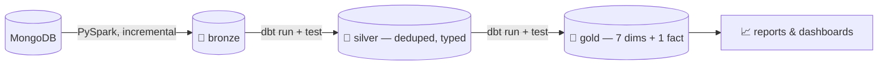

# 🏪 dbt-Powered Medallion Warehouse — Walmart Data Pipeline

**MongoDB → PostgreSQL → dbt**, turning raw operational sales data into a
tested, dimensional warehouse — orchestrated by Airflow, containerized
with Docker, and runnable with one script. dbt owns *every*
transformation from bronze onward: dedup, typing, business rules, and
the final star/snowflake model are dbt models and dbt tests, not
one-off SQL scripts.

## 📊 At a glance

| | |
|---|---|
| 🧱 **17 dbt models** | 9 silver + 8 gold, zero raw SQL bolted on |
| 🔁 **7-stage pipeline** | stops on first failure, every time |
| 🖥️ **3 identical runners** | PowerShell · Docker · Airflow DAG |
| 🛡️ **2 independent test layers** | native `dbt test` + a schema-driven SQL suite that walks `information_schema` — no hardcoded tables |
| 🔍 **6 Mongo collections, auto-discovered** | new collections need zero code changes |
| ⚡ **Incremental by default** | watermarked `MERGE` upserts, not blind re-loads |
| 🚀 **Kafka/CDC streaming** | scoped and designed, next on the roadmap |

## 🧩 How data flows



## ⚙️ Stack

`dbt-core` · `PySpark 3.5` · `PostgreSQL 16` · `Apache Airflow 3.3` (Celery + Redis) · `Docker Compose` · `uv`

## 🚀 Run it

```bash
git clone <this-repo-url> && cd walmart
cp .env.example .env && uv sync --frozen
.\pipeline\run_pipeline.ps1        # or: docker run walmart-pipeline
                                    # or: trigger the Airflow DAG
```

All three paths run the same 7 stages, end to end, no drift between them.

---

📖 **Want the deep dive?** Full architecture, dbt lineage, test inventory,
and the Kafka streaming design live in the [complete README](README.md)
and [`docs/`](docs/).
