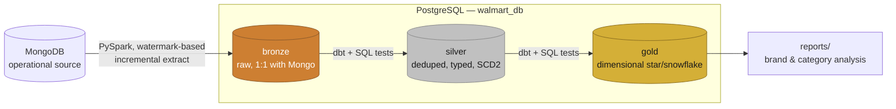
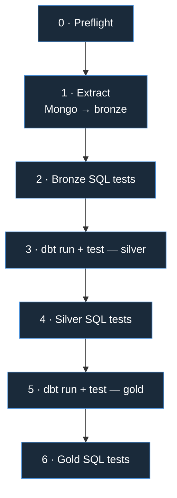

[](https://walmartdbt-b3fdfqwyky3ghzr5syyxtu.streamlit.app/)

#  Walmart Medallion Data Pipeline

A production-style **MongoDB → PostgreSQL → dbt** pipeline: incremental PySpark extraction, a tested medallion warehouse (bronze → silver → gold), orchestrated with **Airflow**, containerized with **Docker**, and gated by two independent layers of data-quality checks at every handoff.

Built to mirror how a real analytics-engineering team would ship this not a notebook demo.

## 📊 Live Dashboard

**[→ Try the interactive sales dashboard](https://walmartdbt-b3fdfqwyky3ghzr5syyxtu.streamlit.app/)**

A Streamlit + Plotly dashboard reading from the gold star schema revenue trends, store/category/brand breakdowns, top products and customers, all with period-over-period KPI deltas. The hosted demo runs against a separate, seeded database with anonymized sample data (see [`scripts/seed_demo_db.py`](scripts/seed_demo_db.py)) it is not the live production pipeline. Full write-up: [`dashboard/README.md`](dashboard/README.md).

## Architecture at a glance



Every arrow into silver and gold is a **quality gate**, not a formality the next layer only builds if the prior layer's tests pass. Full breakdown: [`ARCHITECTURE.md`](ARCHITECTURE.md) §4.

## Orchestration — one pipeline, run three ways

The same 7 stages run locally via PowerShell or on a schedule in Airflow. The
standalone Docker image currently packages the project and validates Postgres
startup, but `main.py` is a scaffold and does not yet run the ETL stages:



In Airflow this is `walmart_medallion_pipeline`, with `all_success` trigger rules stopping the DAG the moment any stage fails. Full DAG + task-by-task detail: [`docs/airflow.md`](docs/airflow.md).

## Highlights

| Area | What's there |
|---|---|
| **Incremental extraction** | Watermark-based `$gt` pushdown from Mongo, real `MERGE`-style upserts, automatic fallback when no watermark or unique index exists |
| **Modeling** | 17 dbt models (9 silver + 8 gold), 100+ tests, SCD Type 2 snapshots |
| **Data quality** | Two independent QA layers — dbt-native tests *and* a standalone schema-driven SQL suite — wired in as separate pipeline stages |
| **Runners** | Windows/PowerShell and Airflow DAG execute the seven stages; the standalone Docker image is a buildable scaffold |
| **Containerization** | Docker Compose stack (CeleryExecutor: scheduler, workers, triggerer, Redis) plus a self-contained pipeline image |
| **Dashboard** | Streamlit + Plotly dashboard querying the gold schema directly — [live demo](https://your-app-name.streamlit.app), source in [`dashboard/`](dashboard/) |
| **CI/CD** | Lint, DAG-integrity checks, and a live bronze→silver→gold run against Postgres on every PR; images published to GHCR on merge — [`docs/ci_cd.md`](docs/CI_CD.md) |

## Tech stack

`Python` · `PySpark` · `dbt-core` · `PostgreSQL` · `MongoDB` · `Apache Airflow` · `Docker` · `PowerShell` · `Streamlit` · `Plotly` · `uv`

## Run it

```powershell
# Local, Windows
./pipeline/run_pipeline.ps1

# Standalone container scaffold (does not run ETL stages yet)
docker run --env-file .env walmart-pipeline

# Full Airflow stack
docker compose -f docker/compose.yml up

# Sales dashboard (reads from your local gold schema)
uv run streamlit run dashboard/app.py
```

## Full documentation

This README is the pitch. Everything below is the engineering detail:

| Doc | Covers |
|---|---|
| [`docs/ARCHITECTURE.md`](docs/ARCHITECTURE.md) | Full system design and execution-path status |
| [`docs/airflow.md`](docs/airflow.md) | The DAG, task by task |
| [`docs/dbt.md`](docs/dbt.md) | Models, grain, SCD types, tests |
| [`docs/docker.md`](docs/docker.md) | Both images, why two, build details |
| [`docs/pipeline.md`](docs/pipeline.md) | The PowerShell entry point |
| [`docs/scripts.md`](docs/scripts.md) | `extract.py`'s incremental vs. full-reload logic |
| [`docs/tests.md`](docs/tests.md) | What the raw SQL checks actually check |
| [`docs/utils.md`](docs/utils.md) | Shared config/connection/logging |
| [`docs/CI_CD.md`](docs/CI_CD.md)  | See how CI/CD works |
| [`docs/project_health_and_security.md`](docs/project_health_and_security.md) | Local health and security checks |
| [`dashboard/README.md`](dashboard/README.md) | Dashboard design: schema, caching, chart choices |

Full pipeline script (`run_pipeline.ps1`): [view on Google Drive](https://drive.google.com/file/d/1vSPYN8GvC5cFMEHf7EVjwSq4HHAbCZRF/view?usp=sharing)

📧 Reach out if you'd like a walkthrough of any part of this project.