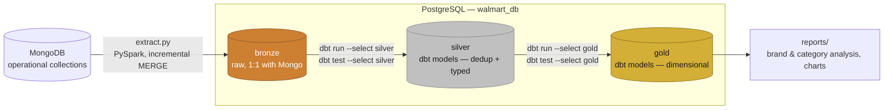
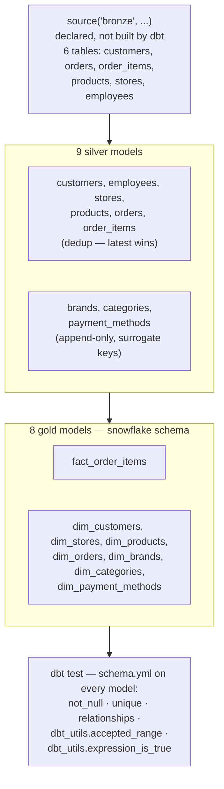
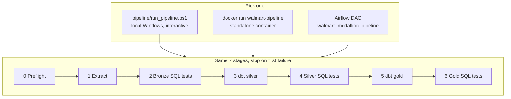
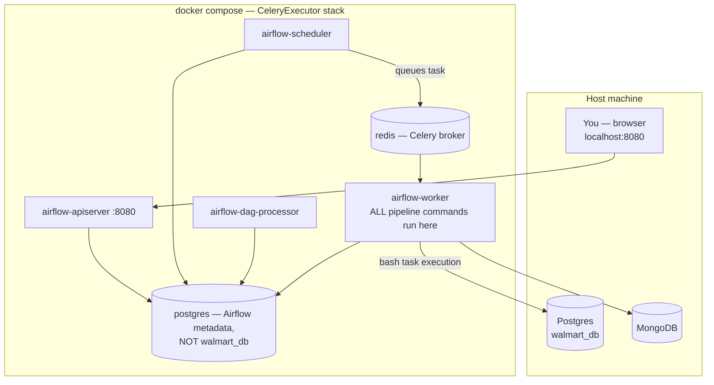
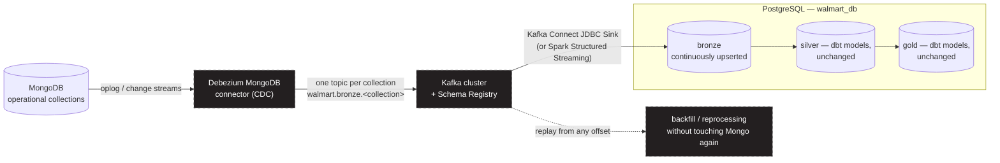

# DBT Powered Medallion Warehouse Walmart


A MongoDB → PostgreSQL → **dbt** pipeline that turns raw, operational
Walmart-style sales data into a tested, dimensional warehouse orchestrated
by Airflow, containerized with Docker, and runnable locally with nothing
but PowerShell and `uv`. **dbt owns every transformation from bronze
onward**: deduplication, type-cleaning, business-rule enforcement, and the
final dimensional model are all dbt models and dbt tests — not hand-rolled
SQL scripts bolted on afterward.

> **TL;DR** — `git clone`, fill in `.env`, `uv sync --frozen`, then either
> `.\pipeline\run_pipeline.ps1` (Windows), `docker run walmart-pipeline`
> (containerized), or trigger the `walmart_medallion_pipeline` DAG in
> Airflow. All three run the identical 7-stage, dbt-centric pipeline. Full
> steps in [§7](#7-getting-started--connecting-the-repo).

---

## Table of contents

1. [The problem](#1-the-problem)
2. [What we built to solve it](#2-what-we-built-to-solve-it)
3. [How it works](#3-how-it-works)
4. [Why dbt sits at the center](#4-why-dbt-sits-at-the-center)
5. [Tech stack](#5-tech-stack)
6. [Repository structure](#6-repository-structure)
7. [Getting started — connecting the repo](#7-getting-started--connecting-the-repo)
8. [Data quality — two layers of defense](#8-data-quality--two-layers-of-defense)
9. [Monitoring, logs & troubleshooting](#9-monitoring-logs--troubleshooting)
10. [Roadmap — what's next](#10-roadmap--whats-next)
11. [Kafka add-on — the planned streaming layer](#11-kafka-add-on--the-planned-streaming-layer)
12. [Documentation](#12-documentation)

---

## 1. The problem

Raw operational data — customers, orders, order items, products, stores,
employees — lives in **MongoDB** as loosely-structured, mutable
collections. That's the right shape for an application; it's the wrong
shape for analytics, for several concrete reasons:

- **No dimensional model.** You can't cleanly ask "revenue by brand last
  quarter" or "top-selling category by store" against a collection of
  nested, application-shaped order documents.
- **No deduplication or consistent change history.** Documents get
  updated in place with no guaranteed "latest version wins" semantics for
  reporting — the same customer or order can look different depending on
  when you last read it.
- **No data-quality guarantees.** Nothing upstream stops a negative
  price, an order referencing a store that doesn't exist, or a malformed
  email from silently reaching a dashboard.
- **No single, trustworthy definition of "correct."** Business logic like
  `line_amount = quantity × unit_price` either lives nowhere, or lives
  duplicated across whichever script last needed it.
- **No repeatable, environment-agnostic build process.** A pipeline
  needs to behave identically whether a developer triggers it by hand on
  Windows, it runs inside a container, or it runs on a schedule —
  without three divergent implementations quietly drifting apart from
  each other over time.
- **No path to lower latency.** The only way to get fresher data today is
  to run the whole batch pipeline again — there's no incremental,
  event-driven option yet (see [§11](#11-kafka-add-on--the-planned-streaming-layer)).

## 2. What we built to solve it

| Problem | Solution |
|---|---|
| Data trapped in Mongo, wrong shape for analytics | `scripts/extract.py` — a PySpark job that auto-discovers every Mongo collection (no hardcoded list) and lands it as raw **bronze** tables in Postgres |
| Re-extracting everything every run doesn't scale | Per-collection **incremental watermarking** (`updated_timestamp` → `updated_at` → `created_timestamp` → `created_at`, auto-detected) with a real Postgres `MERGE` (`INSERT ... ON CONFLICT DO UPDATE`), not a blind append |
| No dedup, no typed/cleaned data | **dbt silver models** — one model per entity, "latest version wins," typed and cleaned, with FK and range tests declared in `schema.yml` |
| No dimensional model for BI | **dbt gold models** — a snowflake-schema dimensional layer (7 dimensions + 1 fact) built entirely in dbt, feeding `reports/` |
| No enforced business rules | dbt's `dbt_utils.expression_is_true` tests encode rules like `line_amount = round(quantity * unit_price, 2)` directly against the warehouse, not in application code |
| No data-quality safety net | **Two complementary test systems**: dbt-native tests (`dbt test`) *and* a generic, schema-driven raw-SQL suite (`tests/`) that discovers tables/columns dynamically from `information_schema` — no per-table hardcoding required |
| Pipeline had to run 3 different ways without drifting | One logical 7-stage pipeline, mirrored exactly across `pipeline/run_pipeline.ps1` (Windows), a standalone Docker image, and an Airflow DAG — all stop on first failure, all documented in lockstep |
| `localhost` / Windows paths silently break inside containers | A single, documented correction pattern applied consistently (env-var rewriting in one place) instead of hacking `.env` differently per environment |
| Batch-only freshness ceiling | Identified and scoped as the next major addition — see the [Kafka roadmap](#11-kafka-add-on--the-planned-streaming-layer) |

The result: `dbt run` and `dbt test` are the heart of the transformation
layer — everything from silver onward is a dbt model, tested by dbt
itself, with a second, independent SQL-based safety net running
alongside it as a belt-and-suspenders check.

---

## 3. How it works

### 3.1 The medallion flow, dbt in the middle



Bronze is the only layer dbt doesn't build — it's declared as a dbt
**source** (`models/bronze/soucre.yml`) and populated by the Python
extraction job instead. From silver onward, **every table in the
warehouse is a dbt model.**

### 3.2 The dbt project itself



Every model carries a `_loaded_at` `not_null` test; foreign keys use the
native `relationships` test; numeric bounds use
`dbt_utils.accepted_range` (inclusive); cross-column business rules use
`dbt_utils.expression_is_true`. Three custom generic test macros
(`accepted_range`, `matches_regex`, `no_orphan_rows`) are also defined
under `walmart_dbt/tests/generic/` for cases the built-ins don't cover.
Full model-by-model grain and test list: [`docs/dbt.md`](docs/dbt.md).

### 3.3 One pipeline, three runners



All three are kept intentionally in lockstep. If you change the stage
order, add a stage, or change what "success" means for one, you update
the Windows script *and* the DAG — nothing enforces this automatically,
it's a documented convention. Full side-by-side comparison and the
`localhost`/Windows-path corrections each runner needs:
[`ARCHITECTURE.md`](ARCHITECTURE.md) §2, §7.

### 3.4 Runtime topology (Airflow path)



Only `airflow-worker` ever executes pipeline logic; every other Airflow
service is scheduling, serving, or metadata machinery. Full breakdown:
[`docs/docker.md`](docs/docker.md) §1, [`docs/airflow.md`](docs/airflow.md) §1.

---

## 4. Why dbt sits at the center

This project treats dbt as more than a "run some SQL" tool — it's the
system of record for what "correct" means at each layer:

- **Transformations are declarative, not imperative.** Silver and gold
  models are `SELECT` statements describing the desired end state; dbt
  figures out materialization and dependency order via the DAG it builds
  from `ref()`/`source()` calls.
- **Tests are colocated with the models they describe.** A rule like "no
  negative prices" or "FK must resolve" lives in the same `schema.yml` as
  the model it constrains, not in a separate, easy-to-forget script.
- **Lineage is free.** `dbt docs generate` produces a browsable DAG of
  every source → silver → gold dependency, without any extra
  documentation effort.
- **Schema routing is centralized.** `macros/generate_schema.sql` is the
  single place that decides which physical Postgres schema each layer
  resolves to — models themselves never hardcode `silver.` or `gold.`.
- **Failure is cheap to isolate.** `dbt run --select dim_products` or
  `dbt test --select customers` lets you iterate on one model without
  re-running the whole pipeline.

---

## 5. Tech stack

| Layer | Tool | Why |
|---|---|---|
| Source | MongoDB | Operational system of record |
| Warehouse | PostgreSQL 16 | Target for bronze/silver/gold |
| Transformation | **dbt-core** + `dbt-postgres` + `dbt-utils` | Declarative models, tests, lineage |
| Extraction | PySpark 3.5.x + MongoDB Spark Connector | Distributed, incremental Mongo → Postgres loads |
| Orchestration | Apache Airflow 3.3.0, CeleryExecutor, Redis | Scheduling, retries, observability |
| Local dependency management | `uv` | Fast, reproducible, `uv.lock`-pinned installs |
| Containerization | Docker / Docker Compose | Portable standalone image + full Airflow stack |
| Data-quality suite (non-dbt) | Raw PL/pgSQL, schema-driven | Independent check on top of dbt's own tests |
| *(planned)* Streaming | Apache Kafka + Debezium (CDC) | See [§11](#11-kafka-add-on--the-planned-streaming-layer) |

---

## 6. Repository structure

```
walmart
├─ airflow/dags/walmart_pipeline_dag.py   ← Airflow orchestration
├─ docker/                                ← Dockerfile, Dockerfile.airflow, compose, dbt profile
├─ docs/                                  ← per-area deep dives (this README links out to them)
├─ jars/                                  ← Mongo Spark connector + Postgres JDBC, checked in
├─ pipeline/run_pipeline.ps1              ← Windows entry point
├─ scripts/                               ← extract.py, sql_test.py
├─ sql/                                   ← hand-written Postgres functions/reports
├─ tests/{bronze,silver,gold}/            ← standalone SQL data-quality suite
├─ utils/                                 ← shared config, connection, logging
├─ walmart_dbt/                           ← THE dbt PROJECT
│  ├─ models/{bronze,silver,gold}/        ← source decl. + 9 silver + 8 gold models
│  ├─ macros/generate_schema.sql          ← routes each layer to its own Postgres schema
│  ├─ tests/generic/                      ← 3 custom dbt test macros
│  └─ dbt_project.yml
├─ reports/                               ← generated markdown + charts
├─ main.py                                ← standalone Docker image entry point
└─ pyproject.toml / uv.lock
```

---

## 7. Getting started — connecting the repo

### 7.1 Prerequisites

| Requirement | Needed for |
|---|---|
| **PostgreSQL 16**, reachable, with a `walmart_db` database | Every run path |
| **MongoDB**, reachable, with your source collections loaded | Every run path |
| **[uv](https://docs.astral.sh/uv/)** installed | Local and dbt-only runs |
| **Java 17** (JVM for PySpark) | Local runs only — both Docker images install this automatically |
| **Docker + Docker Compose** | Standalone image or Airflow stack only |

### 7.2 Clone and configure

```bash
git clone <this-repo-url>
cd walmart

# copy the env template and fill in real values
cp .env.example .env      # POSTGRES_*, MONGO_URI, MONGO_DB, FERNET_KEY, etc.

# install Python deps, exactly as pinned in uv.lock
uv sync --frozen
```

Required variables in `.env` — validated once, at import time, by
`utils/engine.py`; a missing one fails immediately with every missing
name listed, rather than surfacing deep inside a driver call later:

| Category | Variables | Required? |
|---|---|---|
| Postgres | `POSTGRES_HOST`, `POSTGRES_PORT`, `POSTGRES_DATABASE`, `POSTGRES_USERNAME`, `POSTGRES_PASSWORD` | Yes |
| Mongo | `MONGO_URI`, `MONGO_DB` | Yes |
| Medallion schemas | `POSTGRES_SCHEMA_BRONZE`, `POSTGRES_SCHEMA_SILVER`, `POSTGRES_SCHEMA_GOLD` | No — warns if missing |
| PySpark | `PYSPARK_PYTHON`, `PYSPARK_DRIVER_PYTHON` | Read here, consumed by Spark directly |

### 7.3 Set up the dbt project

```bash
cd walmart_dbt
uv run dbt deps          # installs dbt_utils
uv run dbt debug         # confirms the profile (docker/dbt/profiles.yml locally, or ~/.dbt) connects
cd ..
```

### 7.4 Run it — pick one

**A. Local, Windows, interactive:**
```powershell
.\pipeline\run_pipeline.ps1
```

**B. Standalone Docker image:**
```bash
docker build -f docker/Dockerfile -t walmart-pipeline .
docker run --rm --env-file .env walmart-pipeline
```

**C. Airflow, scheduled/containerized:**
```bash
cd docker
mkdir -p ../airflow/dags ../airflow/logs ../airflow/plugins ../airflow/config
cp .env.example .env        # fill in FERNET_KEY
docker compose up airflow-init
docker compose up -d
# UI: http://localhost:8080  (airflow / airflow)
# unpause + trigger: walmart_medallion_pipeline
```

Every path runs the same 7 stages and stops at the first failure — see
[`docs/pipeline.md`](docs/pipeline.md) and [`docs/airflow.md`](docs/airflow.md)
for exactly what each stage does.

### 7.5 Run just the dbt layer, on its own

Once bronze has data (from stage 1 of any runner above), iterate on dbt
directly without re-running extraction or Airflow:

```bash
cd walmart_dbt
dbt run --select silver
dbt test --select silver
dbt run --select gold
dbt test --select gold

# single model, for fast iteration
dbt run --select dim_products
dbt test --select customers

# browse the full lineage graph
dbt docs generate && dbt docs serve
```

---

## 8. Data quality — two layers of defense

```bash
# dbt's own tests (schema.yml-declared, per model)
cd walmart_dbt && dbt test --select silver

# the independent, schema-driven SQL suite
uv run python scripts/sql_test.py tests/bronze
uv run python scripts/sql_test.py tests/silver
uv run python scripts/sql_test.py tests/gold
```

Both must pass before the next layer is allowed to build — enforced by
plain process exit codes in every runner, not custom guard logic in
Python or PowerShell. The SQL suite is intentionally schema-driven (it
walks `information_schema` at runtime) so adding a new table doesn't
require touching the test scripts at all. Full rule inventory:
[`docs/tests.md`](docs/tests.md).

---

## 9. Monitoring, logs & troubleshooting

| Where to look | For what |
|---|---|
| `logs/{name}_{date}.log` | Rotating, per-module file logs — always more detailed than the terminal |
| Airflow Grid view (`localhost:8080`) | Task-by-task pass/fail, per-run |
| `docker compose logs -f airflow-worker` | Where every pipeline command actually executes |
| Postgres `etl_watermarks` / `etl_logs` (bronze schema) | Full extraction audit trail — one row per collection per run |
| `dbt docs serve` | Model lineage, column docs, test coverage |

Common environment issues (Windows CRLF line endings in `.env`, Docker
volume permission on `/app/.venv`, `localhost` meaning "the container
itself") are cataloged with root cause and fix in
[`docs/docker.md`](docs/docker.md) §10.

---

## 10. Roadmap — what's next

| Item | Status |
|---|---|
| **Kafka-based streaming ingestion** (replace/augment batch `extract.py`) | Planned — see [§11](#11-kafka-add-on--the-planned-streaming-layer) |
| dbt-based data contracts / schema enforcement on sources | Under consideration |
| CI pipeline running `dbt test` + the SQL suite on every PR | Under consideration |
| Hosted `dbt docs` site | Under consideration |
| Great Expectations or Soda as a third quality layer | Under consideration |

---

## 11. Kafka add-on — the planned streaming layer

### 11.1 Why

The current pipeline is **batch, pull-based, and polling**: `extract.py`
wakes up, asks Mongo "what changed since my last watermark?", and pulls
it. That's simple and reliable, but it has a hard ceiling — freshness is
bounded by how often you're willing to re-run the whole 7-stage pipeline,
and every run re-pays the cost of a Spark session start, a connector
handshake, and a full pass over each collection's watermark filter, even
when almost nothing changed.

The planned fix is to **add Kafka as an event backbone between Mongo and
bronze**, so bronze can be kept fresh continuously instead of on a
schedule — without touching the dbt layer at all. Silver and gold stay
exactly as they are today; only *how bronze gets populated* changes.

### 11.2 Target architecture



*(Dashed/dark nodes = not built yet — this is the target state, not the
current one.)*

### 11.3 How it changes each stage

| Stage today | Stage with Kafka |
|---|---|
| `extract.py` runs on a schedule, pulls a watermark-filtered batch per collection | Debezium continuously captures Mongo's oplog/change streams and publishes each change as an event — no polling, no watermark bookkeeping in Python |
| One Postgres `MERGE` per pipeline run | Kafka Connect's JDBC Sink (or a small Spark Structured Streaming job) applies upserts to bronze continuously, in near real time |
| A failed extraction means re-running the whole batch | Kafka retains events — a failed sink run can resume from its last committed offset, and historical data can be **replayed** without going back to Mongo |
| Schema drift in Mongo surfaces as a runtime failure in `sanitize_for_postgres()` | A **Schema Registry** (Avro/Protobuf) catches incompatible schema changes at the connector boundary, before they reach Postgres |
| `bronze_sql_tests` / `dbt test --select silver` still run on a schedule | Unchanged — dbt keeps running on its own cadence (e.g., every 15 minutes) against whatever bronze looks like at that moment; Kafka only changes *ingestion* freshness, not the transformation contract |

### 11.4 Why this is additive, not a rewrite

The whole point of putting Kafka **only** between Mongo and bronze is
that nothing downstream has to change:

- **dbt models don't change at all.** They already read from
  `source('bronze', ...)` — they don't know or care whether bronze was
  populated by a batch Spark job or a streaming sink.
- **The test suites don't change.** Both `dbt test` and
  `scripts/sql_test.py` validate the *state* of a table, not how it got
  there.
- **`run_pipeline.ps1` and the Airflow DAG keep their shape.** The
  `extract` stage is simply swapped for "assert the Kafka sink is
  healthy and caught up" instead of "run a batch job and wait for it to
  finish" — stages 2–6 are untouched.

### 11.5 Open questions to resolve before implementation

- **Exactly-once vs. at-least-once semantics** on the JDBC sink, and
  whether the existing `_id`-based `MERGE` upsert logic is sufficient to
  make at-least-once delivery idempotent (it likely is, since it's
  already keyed on Mongo's `_id`).
- **Where dbt's run cadence should live** once bronze is continuously
  fresh — short-interval Airflow scheduling vs. a dbt Cloud-style
  event-triggered run.
- **Local dev ergonomics** — whether a lightweight `docker compose`
  profile (single-broker Kafka + Debezium + Kafka Connect) is worth
  maintaining alongside the existing Airflow compose stack, or whether
  Kafka stays a staging/prod-only addition.
- **Backpressure and ordering guarantees** per collection, particularly
  for `order_items`, where downstream business-rule tests
  (`line_amount = quantity × unit_price`) assume a consistent view of
  both `orders` and `order_items` at test time.

---

## 12. Documentation

| Topic | Doc |
|---|---|
| Full technical architecture, every diagram in one place | [`ARCHITECTURE.md`](ARCHITECTURE.md) |
| dbt models, tests, and the bronze→silver→gold lineage in detail | [`docs/dbt.md`](docs/dbt.md) |
| Airflow DAG, task-by-task | [`docs/airflow.md`](docs/airflow.md) |
| Docker images, compose stack, and the troubleshooting log | [`docs/docker.md`](docs/docker.md) |
| Windows entry-point script | [`docs/pipeline.md`](docs/pipeline.md) |
| `extract.py`'s incremental-load logic | [`docs/scripts.md`](docs/scripts.md) |
| The standalone SQL data-quality suite | [`docs/tests.md`](docs/tests.md) |
| Shared config/connection/logging infra | [`docs/utils.md`](docs/utils.md) |
