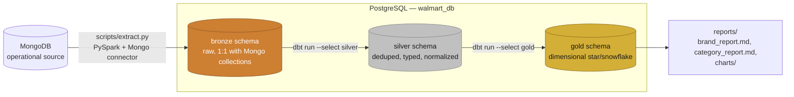
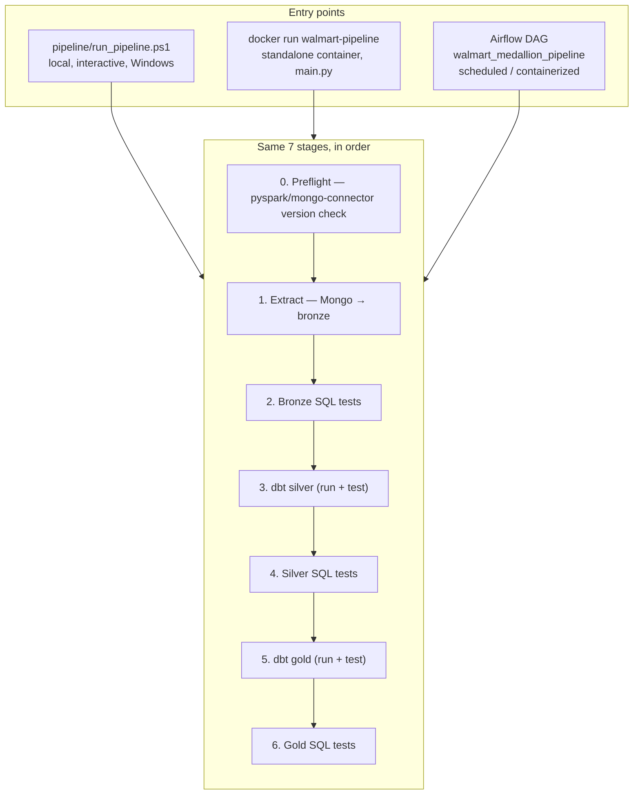
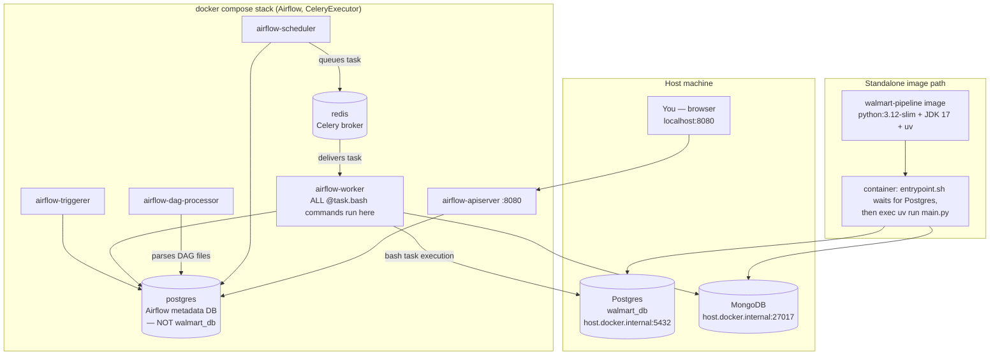
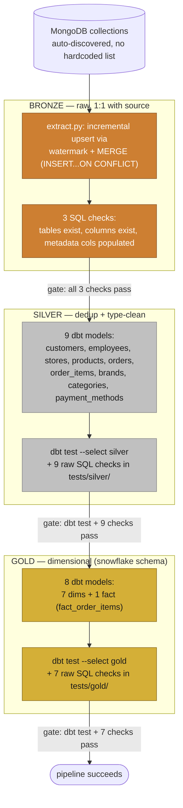
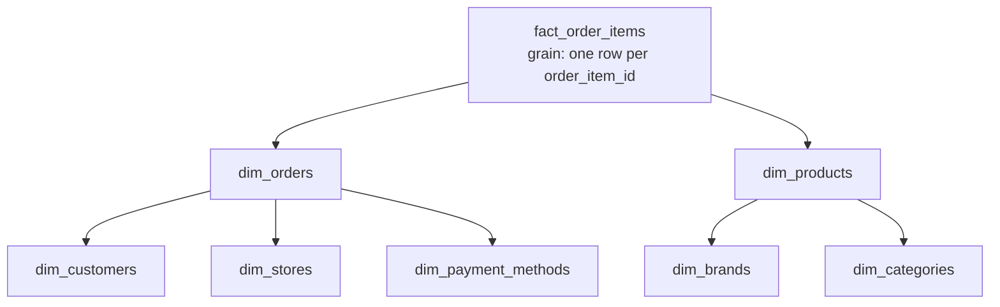
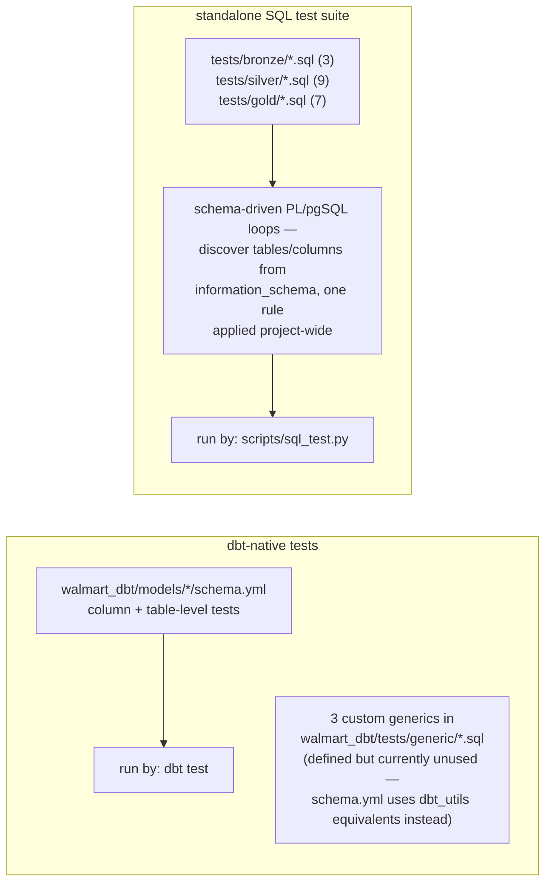
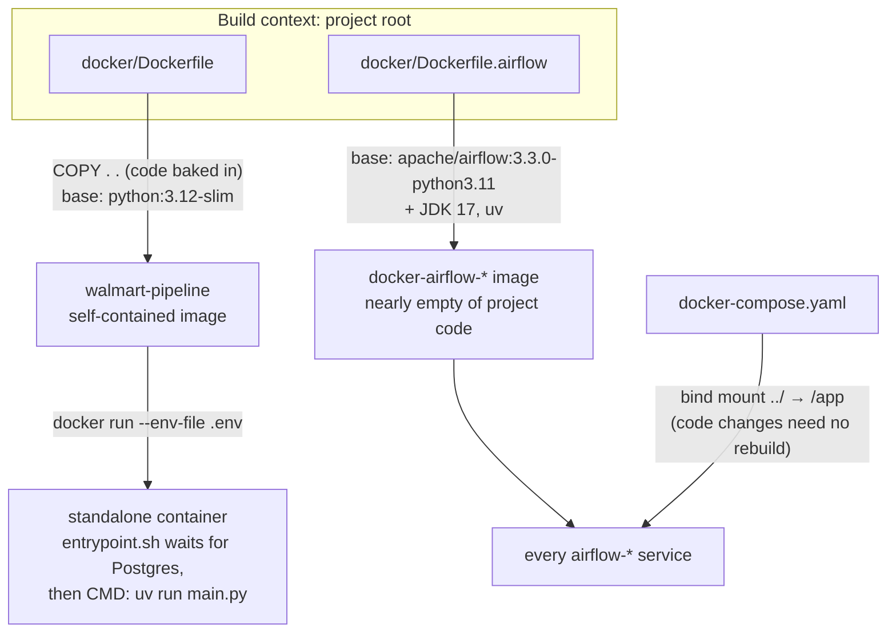
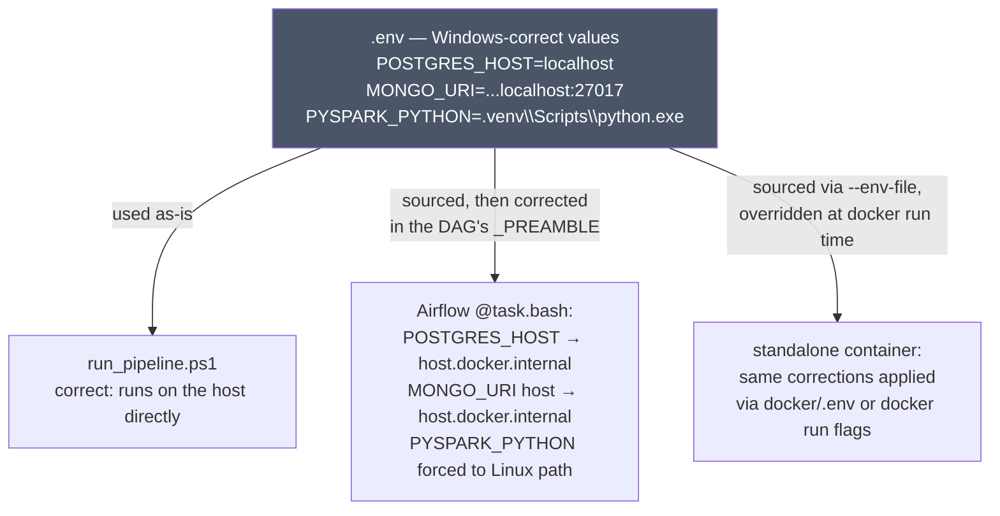
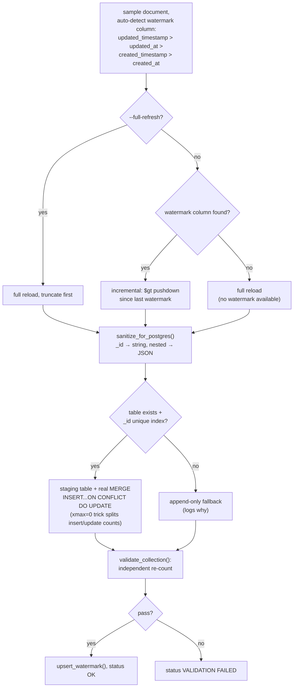
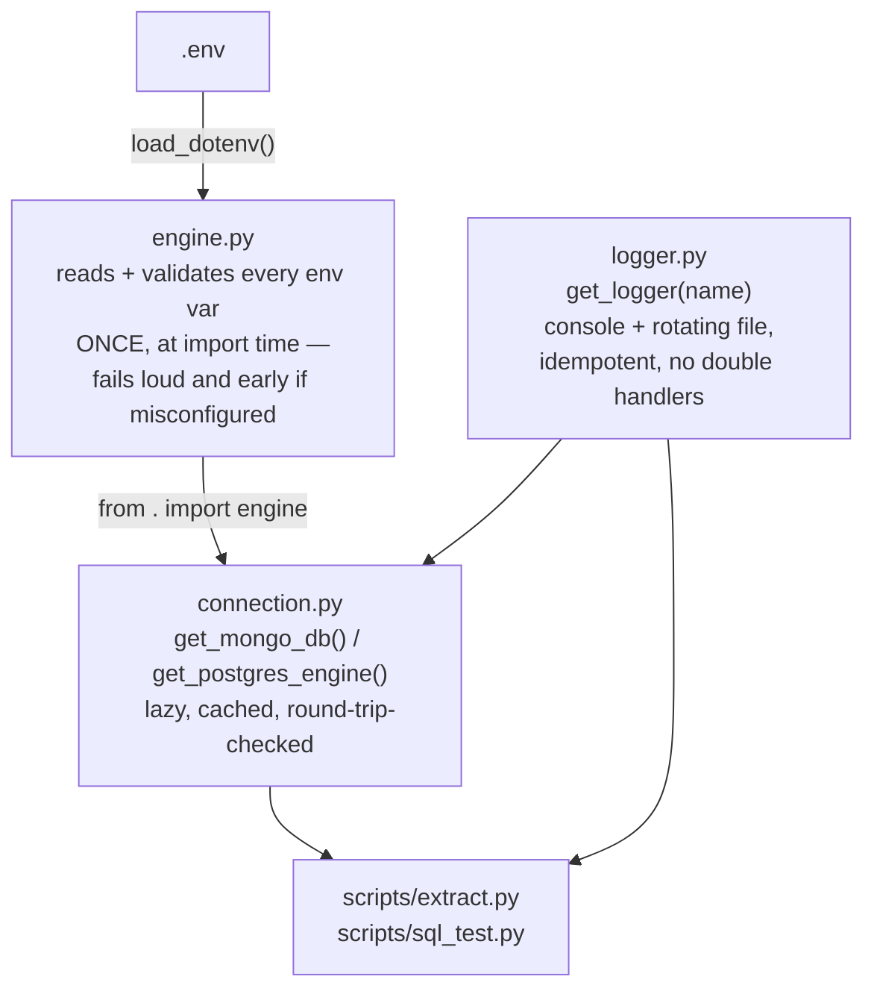

# Architecture — Walmart Medallion Pipeline

This is the single map of the system: what it is, how data moves through
it, how one seven-stage pipeline runs three different ways (a Windows
script, a standalone Docker image, and an Airflow DAG), and how the
supporting pieces — `utils/`, `docker/`, `walmart_dbt/`, `tests/` — fit
around that core. Every section links out to the doc that covers it in
full; this file is the overview, not a replacement for `docs/*.md`.

## Contents

1. [System overview](#1-system-overview)
2. [Three runners, one pipeline](#2-three-runners-one-pipeline)
3. [Runtime topology](#3-runtime-topology--whats-actually-running-where)
4. [The medallion layers, and what gates each transition](#4-the-medallion-layers-and-what-gates-each-transition)
5. [Two independent test systems](#5-two-independent-test-systems--dont-conflate-them)
6. [Two Docker images, two jobs](#6-two-docker-images-two-jobs)
7. [The `localhost` problem, solved once, applied twice](#7-the-localhost-problem-solved-once-applied-twice)
8. [The `extract.py` decision engine](#8-the-extractpy-decision-engine)
9. [Shared infrastructure — `utils/`](#9-shared-infrastructure--utils)
10. [Repository layout](#10-repository-layout)
11. [Where to go next](#11-where-to-go-next)

---

## 1. System overview

A **medallion-architecture ETL pipeline**: it pulls operational data out
of MongoDB, lands it as raw bronze tables in Postgres, cleans and
deduplicates it into silver, and reshapes it into a dimensional gold
layer — validated by SQL checks and dbt tests at every handoff, and
runnable directly on Windows, as a standalone Docker container, or
orchestrated by Airflow.



Every layer is guarded by its own tests before the next layer is allowed
to build from it — see [§4](#4-the-medallion-layers-and-what-gates-each-transition).

---

## 2. Three runners, one pipeline

The project deliberately exposes **one logical pipeline through three
separate entry points**. They aren't three different pipelines — they're
three runners for the same seven stages, kept in lockstep by convention.



| | `run_pipeline.ps1` | Standalone `docker run` | Airflow DAG |
|---|---|---|---|
| **Where it runs** | Directly on the Windows host | Any Docker host, self-contained image | `airflow-worker` container in the compose stack |
| **Stop-on-failure** | Manual — every stage checks `$LASTEXITCODE`, calls `Stop-Pipeline` | Same script logic, inside the container's `main.py`/entrypoint chain | Automatic — Airflow's default `all_success` trigger rule |
| **`.env` loading** | `Import-DotEnv` — custom line-by-line PowerShell parser | `--env-file .env` passed to `docker run` | `source .env` inside each task's shell, via the DAG's `_PREAMBLE` |
| **`localhost` correctness** | Correct as-is — runs on the host | Corrected via env vars passed at `docker run` time | Rewritten to `host.docker.internal` in `_PREAMBLE` |
| **Code delivery** | Already on disk | Baked in at build time (`COPY . .`) | Bind-mounted (`../..:/app`), no rebuild for code changes |
| **Full detail** | [`docs/pipeline.md`](docs/pipeline.md) | [`docs/docker.md`](docs/docker.md) §4, §6–7 | [`docs/airflow.md`](docs/airflow.md) |

**The rule that keeps all three honest:** changing the stage order,
adding a stage, or redefining "success" for one means updating the
Windows script *and* the DAG. Nothing enforces this automatically — it's
a documented convention, not a technical guarantee.

---

## 3. Runtime topology — what's actually running where



Two independent images exist because they serve two different purposes
— see [§6](#6-two-docker-images-two-jobs). Only `airflow-worker` ever
executes pipeline logic; every other Airflow service is
scheduling, serving, or metadata machinery. Full breakdown:
[`docs/docker.md`](docs/docker.md) §1, [`docs/airflow.md`](docs/airflow.md) §1.

---

## 4. The medallion layers, and what gates each transition



Each gate is enforced by exit codes, not application logic: a non-zero
exit from any stage stops everything downstream, whether that stage is a
Python script, a `dbt` command, or a raw SQL file. See [§5](#5-two-independent-test-systems--dont-conflate-them)
and [§8](#8-the-extractpy-decision-engine).

### 4.1 The gold layer is a snowflake, not a pure star

`dim_products` and `dim_orders` keep foreign keys to their own
dimensions (`brand_id`/`category_id`, `store_id`/`customer_id`/
`payment_method_id`) rather than denormalizing names inline — so the
fact table only touches two dimensions directly, and those two fan out
one level further:



Full model-by-model grain, SCD type, and test list: [`docs/dbt.md`](docs/dbt.md) §4–5.

---

## 5. Two independent test systems — don't conflate them

The project runs data-quality checks through **two unrelated
mechanisms** that happen to share the word "tests":



| | dbt tests | Standalone SQL suite |
|---|---|---|
| Defined in | `schema.yml` per model | Individual `.sql` files, one rule each |
| Invoked as | `dbt test --select silver` / `gold` | `uv run python scripts/sql_test.py tests/<layer>` |
| Convention | dbt's own pass/fail semantics | Auto-detected per file: either "SELECT returns violating rows" or "DO block raises an exception" |
| Full detail | [`docs/dbt.md`](docs/dbt.md) | [`docs/tests.md`](docs/tests.md), [`docs/scripts.md`](docs/scripts.md) §2 |

Both are wired into every runner (`run_pipeline.ps1`, the Airflow DAG,
`main.py` inside the standalone container) as separate pipeline stages,
not as a single combined "testing" step.

---

## 6. Two Docker images, two jobs



Both images share the same JDK, `uv` install, and `PYSPARK_*`/`SPARK_*`
env vars, so pipeline behavior is identical regardless of which runner
triggered it — what differs is *how code gets in* (`COPY` vs. bind mount)
and *what needs correcting for a container network* ([§7](#7-the-localhost-problem-solved-once-applied-twice)).
Full rationale, Dockerfile line-by-line: [`docs/docker.md`](docs/docker.md) §1–5.

---

## 7. The `localhost` problem, solved once, applied twice

The single most-repeated theme across every layer of this project:
`.env` is shared between a Windows host (where `localhost` is correct)
and Linux containers (where it isn't) — and the fix is always
**downstream correction, never editing `.env` itself**.



Why this design: `.env` is referenced by multiple independent files
(`run_pipeline.ps1` included), so correcting it in place would break the
one context where it's already right. Every container-specific fix
happens in the consuming layer instead. Full mechanics:
[`docs/airflow.md`](docs/airflow.md) §3, [`docs/docker.md`](docs/docker.md) §9.

---

## 8. The `extract.py` decision engine

The most complex single piece of logic in the project — worth its own
diagram since every other stage is comparatively mechanical (`dbt run`,
`dbt test`, or a SQL file).



Every collection is auto-discovered from Mongo — nothing is hardcoded —
and every run produces a Rich console report plus two Postgres control
tables (`etl_watermarks`, `etl_logs`) for auditability. Full logic,
including the string-vs-BSON-date watermark gotcha: [`docs/scripts.md`](docs/scripts.md) §1.

---

## 9. Shared infrastructure — `utils/`

Every script in the project (`extract.py`, `sql_test.py`, and anything
added later) builds on three small modules rather than each
reimplementing config-loading, connection handling, and logging:



The key design choice: validation happens at **import time**, not
lazily, so a broken `.env` fails immediately with every missing variable
listed at once — instead of surfacing three layers deep inside a
database driver, minutes into a run. Full detail: [`docs/utils.md`](docs/utils.md).

---

## 10. Repository layout

```
walmart
├─ airflow/                 → dags/walmart_pipeline_dag.py, plus bind-mounted logs/plugins/config
├─ docker/                  → Dockerfile, Dockerfile.airflow, docker-compose.yaml, entrypoint.sh, dbt/profiles.yml
├─ docs/                    → this level of documentation (airflow.md, dbt.md, docker.md, pipeline.md, scripts.md, tests.md, utils.md)
├─ jars/                    → Mongo Spark connector + Postgres JDBC jars, checked in for offline Spark startup
├─ pipeline/                → run_pipeline.ps1 (Windows entry point)
├─ scripts/                 → extract.py (Mongo → bronze), sql_test.py (SQL test runner)
├─ sql/                     → hand-written functions/triggers/reports (customer, product, sales-trend analysis)
├─ tests/                   → standalone SQL data-quality suite, one folder per medallion layer
├─ utils/                   → engine.py, connection.py, logger.py — shared infra
├─ walmart_dbt/             → dbt project: silver + gold models, schema tests, custom generics
├─ reports/                 → generated markdown reports + chart PNGs (brand/category analysis)
├─ notebooks/               → exploratory Mongo notebook
├─ main.py                  → entry point for the standalone Docker image
└─ pyproject.toml / uv.lock → dependency management via uv
```

---

## 11. Where to go next

| Question | Doc |
|---|---|
| How does the Airflow DAG work, task by task? | [`docs/airflow.md`](docs/airflow.md) |
| What do the dbt models actually do, layer by layer? | [`docs/dbt.md`](docs/dbt.md) |
| How are the two Docker images built, and what broke getting them running? | [`docs/docker.md`](docs/docker.md) |
| What does the Windows entry-point script do? | [`docs/pipeline.md`](docs/pipeline.md) |
| How does `extract.py` decide incremental vs. full reload? | [`docs/scripts.md`](docs/scripts.md) |
| What do the raw SQL data-quality checks actually check? | [`docs/tests.md`](docs/tests.md) |
| Where does config/connection/logging come from? | [`docs/utils.md`](docs/utils.md) |
