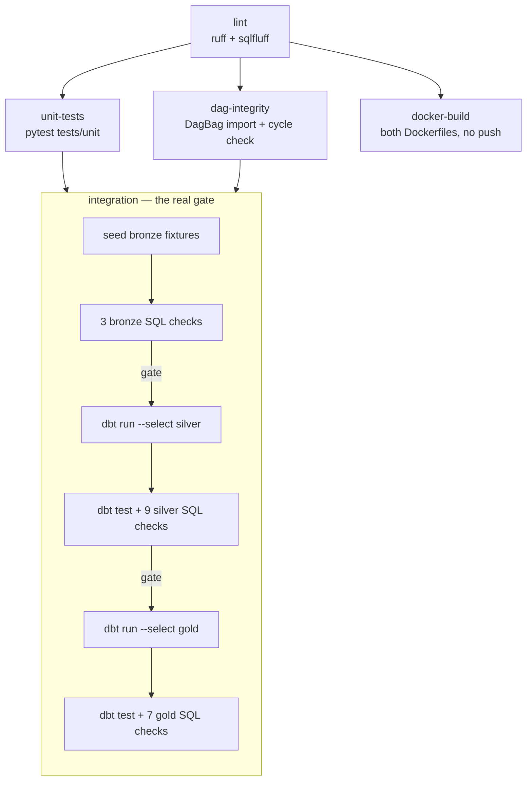
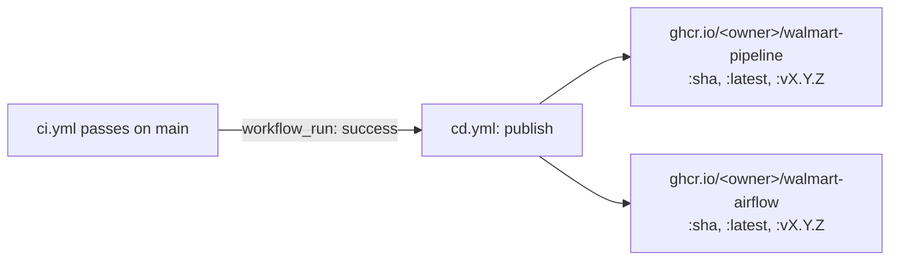

# CI/CD

Two GitHub Actions workflows, kept separate on purpose: `ci.yml` (runs on
every PR and every push to `main`) and `cd.yml` (runs only after `ci.yml`
succeeds on `main`, and publishes images). CD never runs off the back of
a workflow that hasn't been graded — that's the point of the
`workflow_run` trigger instead of a shared `push` trigger.

## 1. CI — five jobs, same gate logic as `run_pipeline.ps1`

`integration` mirrors [§4 of `ARCHITECTURE.md`](../ARCHITECTURE.md#4-the-medallion-layers-and-what-gates-each-transition)
almost exactly — same three gates, same two independent test systems —
except MongoDB is never in the loop. Fixtures are written straight into
`bronze`, because CI needs to be deterministic and shouldn't depend on a
live Mongo instance.

**`docker-build` validates, it doesn't publish.** It exists purely to
catch a broken `Dockerfile` on a PR — the actual push happens in CD.

## 2. CD — publish on a green `main`

Both images are tagged by short SHA (always) and `latest` (on `main`). No live deployment
target exists for this project — the pipeline runs locally via
`run_pipeline.ps1` or the Airflow compose stack — so "CD" here means
*publish a versioned, pullable image*, not *deploy to a server*. If that
changes later (e.g. a scheduled Airflow host), `cd.yml` is where a
`docker compose pull && docker compose up -d` step over SSH would go.

## 3. What still needs to exist in the repo for this to run green

| Needed | Why | Where |
|---|---|---|
| `tests/unit/` with pytest coverage for `utils/` and `extract.py` | `unit-tests` job currently has nothing to collect | new folder |
| `scripts/ci_seed_bronze.py` | writes fixture rows into `bronze` schema so `integration` doesn't need live Mongo | new script |
| A `ci` target in `docker/dbt/profiles.yml` pointing at `localhost:5432` / `walmart` / `walmart` | `dbt run --target ci` needs it | edit existing file |
| `ruff` + `sqlfluff` as dev dependencies, plus a `[tool.ruff]` / `.sqlfluff` config | `lint` job assumes both are installed via `uv sync` | `pyproject.toml`, `.sqlfluff` |

The `ci_seed_bronze.py` fixture loader is the one piece worth getting
right rather than guessing at — it has to match the actual bronze
column shapes `extract.py`'s `sanitize_for_postgres()` produces. Share
`utils/connection.py` and one bronze table's DDL and this can be
generated to match exactly rather than approximated.

## 4. Required repo settings

- **Settings → Actions → General → Workflow permissions**: "Read and
  write permissions", so `cd.yml` can push to GHCR with the default
  `GITHUB_TOKEN` (no PAT needed).
- **Settings → Packages**: after the first successful `cd.yml` run,
  link the two new packages to this repo if they don't auto-link.
