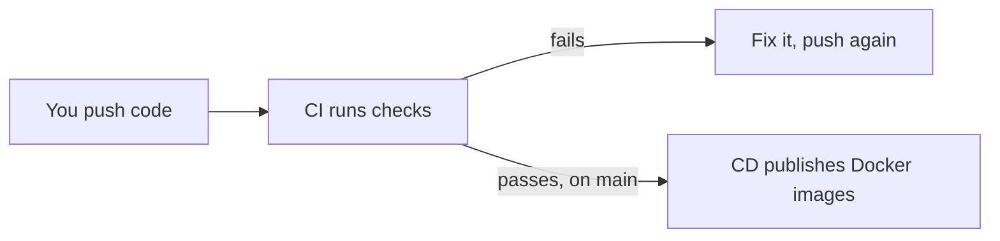
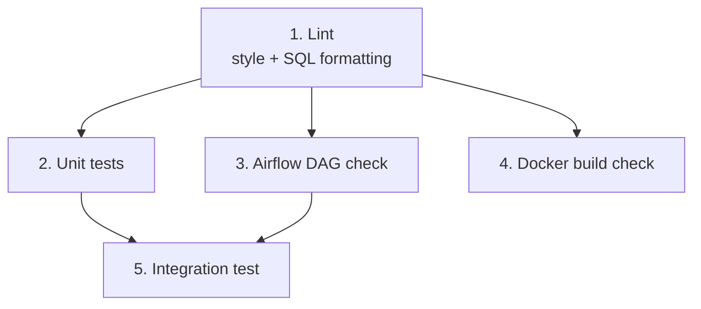
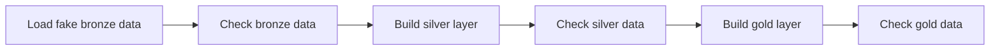
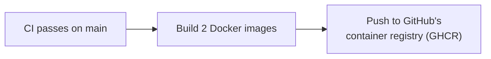

# CI/CD — Explained Simply

## What CI and CD actually mean

**CI (Continuous Integration)** — every time someone pushes code or opens
a PR, a robot automatically checks it: does it follow style rules? Do the
tests pass? Does it build? You find out in minutes, not after it breaks
something in production.

**CD (Continuous Delivery)** — once CI says the code on `main` is good,
another robot automatically packages it (here: Docker images) and
publishes it somewhere people can pull it from.

In this project: **`ci.yml`** is the checker. **`cd.yml`** is the
publisher. They're two separate files on purpose — CD only ever runs on
code that CI has already approved.

---

## What CI does here — 5 jobs

| Job | What it checks, in plain terms |
|---|---|
| **lint** | Is the code and SQL formatted consistently? Runs first — no point running slow tests on messy code. |
| **unit-tests** | Do the small, isolated pieces of Python code (`utils/`, `extract.py` logic) work correctly? |
| **dag-integrity** | Does the Airflow pipeline definition actually load without errors or circular dependencies? |
| **docker-build** | Do both Docker images actually build? This job never pushes anything — it just proves the `Dockerfile`s aren't broken. |
| **integration** | The real test: spin up a throwaway Postgres, load fake sample data, and run the **entire** bronze → silver → gold pipeline exactly like it would run for real. |

### Integration — the important one

This job rebuilds the whole medallion pipeline against a temporary
database, using fake data instead of real MongoDB:

Each arrow is a **gate**: if a check fails, everything after it stops.
This mirrors exactly what `run_pipeline.ps1` and the real Airflow DAG do
— CI is just running the same logic somewhere disposable, so a bug is
caught before it ever touches real data.

---

## What CD does here

Two images get built and published:

- `walmart-pipeline` — the standalone image
- `walmart-airflow` — the image the Airflow stack runs on

Both get tagged with the commit's short SHA and `latest`. There's no
live server this deploys to — "CD" here just means *make a fresh,
pullable image available*, not *push to a website*. If this project
ever gets a real always-on host, that's where a deploy step would be
added to `cd.yml`.

**Why CD waits for CI, instead of running on every push directly:**
if `cd.yml` triggered on `push` the same way `ci.yml` does, it could
publish a broken image the moment code lands on `main`, before anyone
knows it's broken. Instead, `cd.yml` triggers on `ci.yml` finishing —
and only publishes if that run succeeded.

---

## The short version

| | Runs when | Job |
|---|---|---|
| **CI** | Every PR, every push to `main` | Catch problems early |
| **CD** | Only after CI passes on `main` | Publish trusted, working images |

If you remember one thing: **CI protects `main`, CD only ships what CI
already approved.**