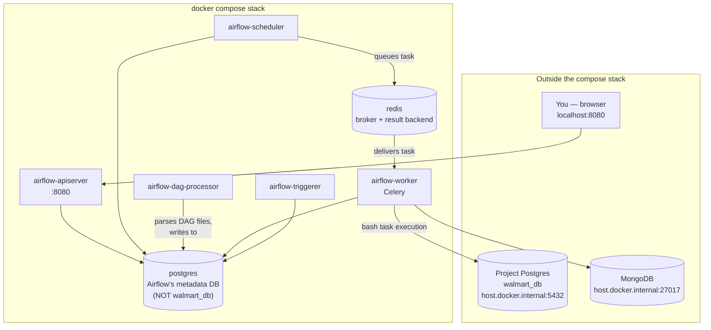
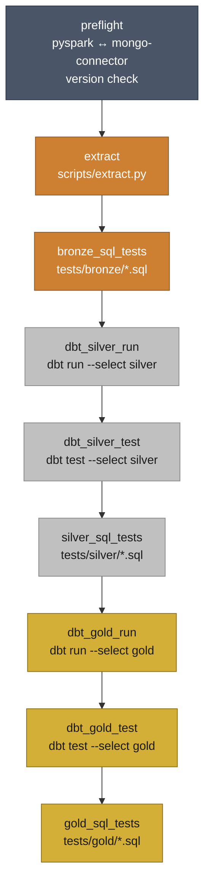
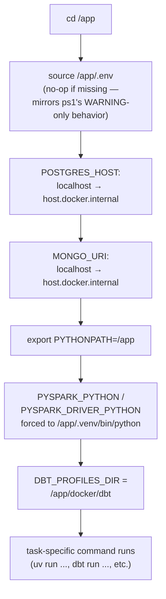
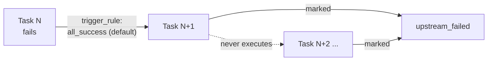

# Airflow Setup — Walmart Medallion Pipeline

This document covers the Airflow side specifically: the CeleryExecutor
architecture the compose stack stands up, the `walmart_medallion_pipeline`
DAG itself, how each task gets a correct environment, and how to actually
run and monitor it. For the Docker images and compose file mechanics
underneath all of this, see `docker.md`.

---

## 1. Why CeleryExecutor

The compose stack (`docker/docker-compose.yaml`) runs Airflow's
CeleryExecutor setup rather than the simpler LocalExecutor — task
execution is handed off through a Redis-backed queue to a dedicated
`airflow-worker` container, separate from the scheduler and API server.
For a 9-task linear DAG this is more infrastructure than strictly
necessary, but it's what the official Airflow 3.3.0 quick-start
provisions, and it's what this project's `docker-compose.yaml` was
adapted from.



**Roles, briefly:**

| Service | Job |
|---|---|
| `airflow-apiserver` | Serves the web UI and REST API on `:8080` |
| `airflow-scheduler` | Decides what should run when, queues tasks onto Redis |
| `airflow-dag-processor` | Parses `airflow/dags/*.py` files, keeps DAG definitions in the metadata DB up to date |
| `airflow-worker` | Actually executes tasks — this is the container every `@task.bash` command runs inside |
| `airflow-triggerer` | Handles deferred/async tasks (not used by this DAG, but part of the standard stack) |
| `postgres` | Airflow's own internal metadata store — DAG runs, task instances, connections, users |
| `redis` | Celery's message broker and result backend |

Every actual pipeline command in this project runs inside
**`airflow-worker`** — that's the container to check logs on if something
looks like an environment problem rather than a DAG-definition problem.

---

## 2. The DAG: medallion architecture, one task per stage

`airflow/dags/walmart_pipeline_dag.py` mirrors `pipeline/run_pipeline.ps1`
stage-for-stage, in the same order, and gets the same
stop-on-first-failure behavior for free — Airflow's default trigger rule
(`all_success`) means the instant one task fails, everything downstream
is marked `upstream_failed` and never runs. No custom guard logic needed.



**Task-by-task:**

| # | task_id | Command | Layer |
|---|---|---|---|
| 0 | `preflight` | checks installed `pyspark` version, pins to `3.5.5` if missing/wrong (mongo-spark-connector requires `3.5.x`) | — |
| 1 | `extract` | `uv run python scripts/extract.py` | Bronze |
| 2 | `bronze_sql_tests` | `uv run python scripts/sql_test.py tests/bronze` | Bronze |
| 3 | `dbt_silver_run` | `cd walmart_dbt && uv run dbt run --select silver` | Silver |
| 4 | `dbt_silver_test` | `cd walmart_dbt && uv run dbt test --select silver` | Silver |
| 5 | `silver_sql_tests` | `uv run python scripts/sql_test.py tests/silver` | Silver |
| 6 | `dbt_gold_run` | `cd walmart_dbt && uv run dbt run --select gold` | Gold |
| 7 | `dbt_gold_test` | `cd walmart_dbt && uv run dbt test --select gold` | Gold |
| 8 | `gold_sql_tests` | `uv run python scripts/sql_test.py tests/gold` | Gold |

Every task is a `@task.bash` — the DAG builds each one's shell command as
a Python string, prefixed with a shared `_PREAMBLE` (next section), rather
than using `BashOperator` directly. Functionally equivalent, just a
cleaner way to compose the repeated setup logic once.

DAG-level settings worth knowing:
- `schedule=None` — manual trigger only, no cron
- `catchup=False` — won't backfill historical runs
- `max_active_runs=1` — one run at a time
- `default_args={"retries": 0}` — a failed task stays failed until you
  manually clear it; nothing silently retries in the background

---

## 3. The `_PREAMBLE` — every task's environment, resolved once

`@task.bash` does **not** auto-load `.env` the way `run_pipeline.ps1`'s
`Import-DotEnv` does on the Windows side, so every single task command is
built by concatenating a shared preamble in front of the task-specific
command:

```python
_PREAMBLE = (
    "set -euo pipefail; "
    f"cd {PROJECT_ROOT}; "
    f'if [ -f "{PROJECT_ROOT}/.env" ]; then set -a; source "{PROJECT_ROOT}/.env"; set +a; fi; '
    'export POSTGRES_HOST="${POSTGRES_HOST/localhost/host.docker.internal}"; '
    'export MONGO_URI="${MONGO_URI//localhost/host.docker.internal}"; '
    f"export PYTHONPATH={PROJECT_ROOT}; "
    "export PYSPARK_PYTHON=/app/.venv/bin/python; "
    "export PYSPARK_DRIVER_PYTHON=/app/.venv/bin/python; "
    f"export DBT_PROFILES_DIR={PROJECT_ROOT}/docker/dbt; "
)
```



Why each override exists, in order:

1. **`source .env`** — pulls in `POSTGRES_*`, `MONGO_URI`, `FERNET_KEY`,
   etc. This file is shared with local Windows runs, so several of its
   values are correct for that context but wrong for a Linux container —
   which is exactly what the next three lines fix.
2. **`POSTGRES_HOST` / `MONGO_URI` rewritten** — `localhost` inside a
   container means the container itself, not the host machine where
   Postgres and Mongo actually run. The substitution
   (`${VAR/localhost/host.docker.internal}`) only touches the value *if*
   it contains `localhost`, so this is a safe no-op if `.env` ever points
   somewhere else entirely (a real remote host, say).
3. **`PYTHONPATH=/app`** — same reasoning as the Dockerfile's own `ENV`,
   restated here because `source .env` runs first and doesn't set it.
4. **`PYSPARK_PYTHON` forced back to the Linux path** — `Dockerfile.airflow`
   already sets this correctly as an image-level `ENV`, but `.env` (which
   has the *Windows* path, for `run_pipeline.ps1`'s benefit) gets sourced
   afterward and would silently overwrite it. Re-exporting here makes the
   container's value win regardless of `.env`'s contents.
5. **`DBT_PROFILES_DIR`** — points dbt at the project-scoped
   `docker/dbt/profiles.yml` instead of its `~/.dbt` default, which
   doesn't exist in this container (see `docker.md` §8 for the full
   reasoning).

The deliberate design choice throughout: **`.env` itself is never
modified.** Every container-specific correction happens downstream, in
this preamble, rather than upstream in a file several other things
(`run_pipeline.ps1` included) also depend on.

---

## 4. Stop-on-first-failure



This is native to Airflow's default behavior, not something built by
hand: every task's default `trigger_rule` is `all_success`, so the moment
one task fails, every task downstream of it is marked `upstream_failed`
and simply never runs — functionally identical to `run_pipeline.ps1`'s
own `Stop-Pipeline` behavior, just implemented for free by the scheduler
instead of custom guard logic in the DAG.

Combined with `default_args={"retries": 0}`, a failed run stays exactly
where it failed until a task is manually cleared — nothing retries or
continues silently in the background.

---

## 5. Running and monitoring

**First-time setup** (from `docker/`):
```bash
mkdir -p ../airflow/dags ../airflow/logs ../airflow/plugins ../airflow/config
cp .env.example .env        # fill in FERNET_KEY
docker compose up airflow-init
docker compose up -d
```

**In the UI** (`http://localhost:8080`, login `airflow` / `airflow`):
1. Confirm `walmart_medallion_pipeline` is listed with all 9 tasks
2. Unpause it (DAGs start paused — `AIRFLOW__CORE__DAGS_ARE_PAUSED_AT_CREATION: 'true'`)
3. Trigger manually
4. Watch the Grid view — each task box colors in as it runs

**After editing the DAG file itself:** no rebuild needed — it's
bind-mounted, so `airflow-dag-processor` picks up the change on its next
parse pass (usually within seconds).

**After editing `Dockerfile.airflow`:** rebuild is required, and the
containers need force-recreating so any anonymous volumes (like
`/app/.venv`) regenerate from the new image rather than reusing stale
ones:
```bash
docker compose up -d --build --force-recreate
```

**Re-running after a failure:** click the failed task box → **Clear** →
**Confirm**. This re-queues that task and everything downstream in the
same run; tasks that already succeeded upstream are left alone.

---

## 6. Troubleshooting log (DAG/task-specific)

The full debugging history — including the two purely Docker-level issues
(`.env` line endings, `/app/.venv` volume permissions) — lives in
`docker.md` §10. The subset that's specifically about the DAG's own
environment handling:

| Symptom | Root cause | Fix |
|---|---|---|
| `extract` task: Mongo `AutoReconnect`, connection refused on `localhost:27017` | `MONGO_URI` in `.env` pointed at `localhost` | `_PREAMBLE` rewrites the host to `host.docker.internal` |
| (pre-empted before it broke a run) PySpark would have failed to start | `.env`'s `PYSPARK_PYTHON` is a Windows path, sourced *after* the image's correct Linux `ENV` value | `_PREAMBLE` re-exports the Linux path after sourcing `.env` |
| `dbt_silver_run`: `Invalid value for '--profiles-dir': Path '/home/airflow/.dbt' does not exist` | dbt's default profile location isn't part of the repo and was never mounted in | `_PREAMBLE` sets `DBT_PROFILES_DIR` to the project-scoped `docker/dbt/profiles.yml` |

---

## 7. Quick reference

```bash
# From docker/
docker compose up -d                              # normal start
docker compose up -d --build --force-recreate      # after Dockerfile.airflow changes
docker compose logs -f airflow-worker              # tail worker logs (where tasks run)
docker compose down                                # stop everything
docker compose down -v                             # stop + wipe volumes (fresh metadata DB, fresh .venv)

# UI: http://localhost:8080  (airflow / airflow)
# DAG: walmart_medallion_pipeline — unpause, trigger, watch the Grid view
```