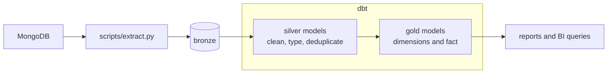
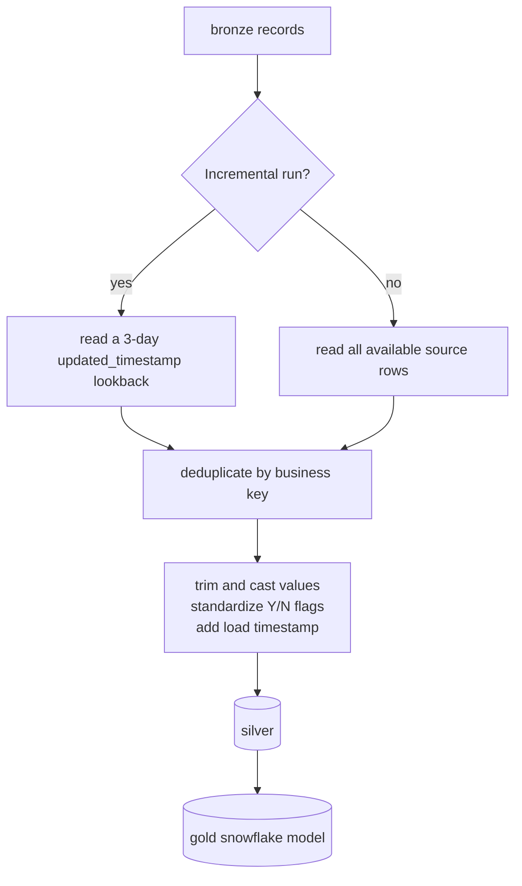

# dbt Transformations

`walmart_dbt/` is the transformation layer of this project. dbt does not
extract data from MongoDB: `scripts/extract.py` first lands raw collections in
Postgres `bronze`; dbt then builds the cleaned `silver` and analytical `gold`
schemas.



## How dbt works here

dbt compiles SQL and Jinja into SQL for Postgres, builds models in dependency
order, and runs data tests. Two Jinja helpers express those dependencies:

- `source('bronze', 'orders')` reads a raw table declared in
  `models/bronze/source.yml`.
- `ref('orders')` reads another dbt model and makes dbt build it first.

`dbt_project.yml` sends silver models to the `silver` schema and gold models
to the `gold` schema. The bronze source is declared only; dbt never builds or
modifies bronze tables.

## Transformations



Most silver and gold entity models use incremental `merge` materialization:
they use a business key such as `customer_id` or `order_id`, retain the latest
record by `updated_timestamp`, and synchronize new columns. The 3-day lookback
helps capture late-arriving updates before the merge replaces the target row.

`brands`, `categories`, and `payment_methods` are append-only lookup models.
They derive distinct normalized labels from bronze data and assign stable
surrogate keys. Their matching gold dimensions also append only. Other gold
models merge cleaned silver entities into dimensions, while
`fact_order_items` keeps one row per order item.

Gold is a snowflake rather than a fully flattened star: the fact references
orders and products, and those dimensions retain foreign keys to customer,
store, payment-method, brand, and category dimensions.

## Models

| Layer | Models | Purpose |
|---|---:|---|
| Bronze | 6 declared sources | Raw `customers`, `employees`, `stores`, `products`, `orders`, and `order_items` tables |
| Silver | 9 | Clean entities plus normalized brands, categories, and payment methods |
| Gold | 7 dimensions + 1 fact | Query-ready customer, product, order, and order-item analytics |

## Tests

Model tests live beside the models in:

- `models/silver/schema.yml`
- `models/gold/schema.yml`

They verify keys are unique and non-null, relationships point to valid parent
records, numeric amounts are within allowed ranges, boolean-like flags contain
accepted values, and line totals equal `quantity * unit_price`. The project
uses dbt's built-in tests and `dbt_utils`; reusable custom test definitions
also live in `tests/generic/`.

These are different from the root-level SQL quality suite in `tests/`. dbt
tests validate dbt model contracts; `scripts/sql_test.py` runs the standalone
bronze, silver, and gold database checks.

## Commands

Run these from the repository root:

```powershell
$env:DBT_PROFILES_DIR = "docker/dbt"
uv run dbt run --project-dir walmart_dbt --select silver
uv run dbt test --project-dir walmart_dbt --select silver
uv run dbt run --project-dir walmart_dbt --select gold
uv run dbt test --project-dir walmart_dbt --select gold

# Rebuild incremental models from scratch when required
uv run dbt run --project-dir walmart_dbt --select silver gold --full-refresh
```

For the full pipeline order and the separate SQL checks, see
[`pipeline.md`](pipeline.md) and [`tests.md`](tests.md).
