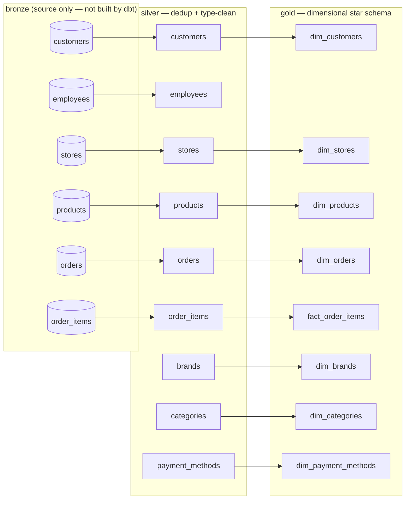
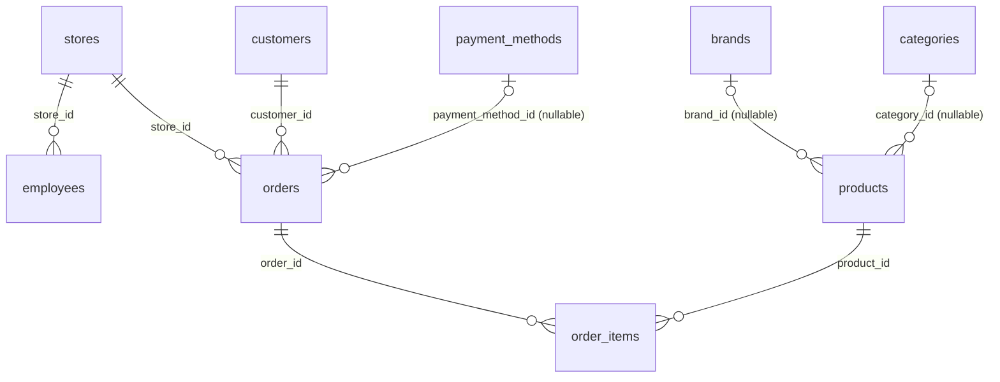
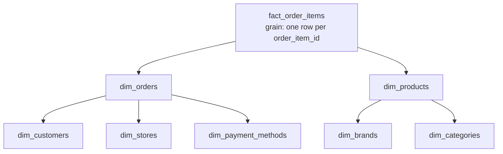

# dbt Models & Tests — `walmart_dbt/`

Everything dbt-native in this project: the bronze source declaration, the
9 silver models, the 8 gold models, and both the built-in tests and the
3 custom generic tests defined locally. For the *other* set of SQL tests
in this project (`tests/bronze`, `tests/silver`, `tests/gold` at the
project root) — see §8, since it's easy to mix the two up.

---

## 1. One direction: bronze → silver → gold



Bronze is declared, never built — it's raw Postgres tables written by
`scripts/extract.py`, referenced from dbt via `source('bronze', ...)`,
not a `dbt run` target. Silver is where deduplication and type-cleaning
happen. Gold is the dimensional layer everything downstream (BI,
reporting) is meant to query.

---

## 2. File map

```
walmart_dbt/
├─ models/
│  ├─ bronze/
│  │  └─ soucre.yml          ← source declaration only, no models
│  ├─ silver/
│  │  ├─ brands.sql, categories.sql, customers.sql, employees.sql,
│  │  │  orders.sql, order_items.sql, payment_methods.sql,
│  │  │  products.sql, stores.sql
│  │  └─ schema.yml           ← tests + descriptions for all 9 above
│  └─ gold/
│     ├─ dim_brands.sql, dim_categories.sql, dim_customers.sql,
│     │  dim_orders.sql, dim_payment_methods.sql, dim_products.sql,
│     │  dim_stores.sql, fact_order_items.sql
│     └─ scgema.yml           ← tests + descriptions for all 8 above
├─ macros/
│  └─ generate_schema.sql     ← routes each layer to its own Postgres schema
└─ tests/
   └─ generic/
      ├─ test_accepted_range.sql
      ├─ test_matches_regex.sql
      └─ test_no_orphan_rows.sql
```

---

## 3. `models/bronze/soucre.yml` — the source declaration

```yaml
version: 2
sources:
  - name: bronze
    database: walmart_db
    schema: bronze
    tables:
      - name: customers
      - name: orders
      - name: order_items
      - name: products
      - name: stores
      - name: employees
```

This is a pure declaration — six tables, zero column-level tests defined
here. It exists so silver models can reference bronze tables via
`{{ source('bronze', 'customers') }}` instead of hardcoding
`bronze.customers`, which is what lets `macros/generate_schema.sql`
control which physical Postgres schema each layer actually resolves to
without every model needing to know about it.

Bronze itself has **no dbt-level tests** — its data quality checks
(`tests/bronze/*.sql`) run through the separate SQL-runner system covered
in §8, not through `dbt test`.

---

## 4. Silver layer — dedup and normalize

`models/silver/schema.yml` documents all 9 silver models. They split into
two distinct patterns:

**Deduplicated entity models** — one row per natural ID, "latest version
wins based on `updated_timestamp`":

| Model | Grain | Notable tests |
|---|---|---|
| `customers` | `customer_id` | `email` checked against a regex via `dbt_utils.expression_is_true` (severity `warn`, not `error`) |
| `employees` | `employee_id` | `store_id` FK → `stores`; `salary` must be ≥ 0 |
| `stores` | `store_id` | — |
| `products` | `product_id` | `brand_id`/`category_id` FKs (nullable); `price` ≥ 0 |
| `orders` | `order_id` | `store_id`/`customer_id` FKs (required); `payment_method_id` FK (nullable); `total_amount` ≥ 0 |
| `order_items` | `order_item_id` | `order_id`/`product_id` FKs; **table-level** check: `line_amount = round(quantity * unit_price, 2)` |

**Append-only dimension-extraction models** — surrogate keys assigned via
`ROW_NUMBER`, existing IDs never change once assigned:

| Model | Grain | Notable tests |
|---|---|---|
| `brands` | `brand_id` | `brand_name` unique + not null |
| `categories` | `category_id` | `category_name` unique + not null |
| `payment_methods` | `payment_method_id` | `payment_method_name` unique + not null |

Every model in both groups has a `silver_loaded_at` `not_null` test. Worth
noting: the `unique` test on `silver_loaded_at` is present in the YAML
but **commented out** (`# - unique`) on every one of these — consistent
with rows loaded in the same batch sharing one timestamp, so uniqueness
on that column alone wouldn't hold.



---

## 5. Gold layer — the dimensional model

`models/gold/scgema.yml` documents 7 dimension tables + 1 fact table.
Each dimension's own description says it's "**fully normalized** — FKs to
their own dimension tables, no denormalized names" — meaning
`dim_products` keeps `brand_id`/`category_id` as foreign keys rather than
inlining `brand_name`/`category_name` as text, and `dim_orders` keeps
`store_id`/`customer_id`/`payment_method_id` rather than denormalizing
those either.

That design choice makes this technically a **snowflake schema**, not a
pure star schema: the fact table only references `dim_orders` and
`dim_products` directly, and those two dimensions are themselves
normalized out one level further:



| Model | Grain | Type | Key tests |
|---|---|---|---|
| `dim_brands`, `dim_categories`, `dim_payment_methods` | 1:1 mirror of their silver counterpart | Append-only | name columns `unique` + `not_null`, `gold_loaded_at` `not_null` |
| `dim_customers` | `customer_id`, Type 1 (latest wins) | SCD1 | `email`, `city`/`province`/`country` all `not_null`; `is_active` restricted to `'true'`/`'false'` |
| `dim_stores` | `store_id`, Type 1 | SCD1 | same shape as `dim_customers` |
| `dim_products` | `product_id`, Type 1 | SCD1 | `brand_id`/`category_id` FKs (nullable); `price` ≥ 0 |
| `dim_orders` | `order_id`, Type 1 | SCD1 | `store_id`/`customer_id` FKs (required); `payment_method_id` FK (nullable); `total_amount` ≥ 0 |
| `fact_order_items` | `order_item_id` | Fact | `order_id`/`product_id` FKs (required); `quantity` ≥ 1; `unit_price`/`line_amount` ≥ 0; table-level `line_amount = round(quantity * unit_price, 2)` |

Every single model — dims and fact alike — carries a `gold_loaded_at`
`not_null` test, the gold-layer equivalent of silver's `silver_loaded_at`.

`is_active` is consistently tested with `accepted_values: ['true', 'false']`,
`quote: false`, scoped with `where: "is_active is not null"` — allowing
the column itself to be nullable while still constraining whatever
non-null values do appear.

---

## 6. Business-rule tests (not just column checks)

Two tests validate a *relationship between columns*, not just one column
in isolation, via `dbt_utils.expression_is_true`:

| Model | Rule | Severity |
|---|---|---|
| `order_items` (silver) / `fact_order_items` (gold) | `line_amount = round(quantity * unit_price, 2)` | `error` |
| `customers` (silver) | `email` matches `^[A-Za-z0-9._%+-]+@[A-Za-z0-9.-]+\.[A-Za-z]{2,}$` | `warn` — a malformed email fails the test but doesn't fail the whole `dbt test` run |

---

## 7. Custom generic tests — `tests/generic/*.sql`

Three custom, reusable dbt tests, defined as Jinja `` macros:

```sql

SELECT {{ column_name }}
FROM {{ model }}
WHERE
     {{ column_name }} < {{ min_value }} 
     OR 
     {{ column_name }} > {{ max_value }} 

```
Flags rows strictly outside `[min_value, max_value]` — the bounds
themselves pass (inclusive), and either bound alone is optional.

```sql

SELECT {{ column_name }}
FROM {{ model }}
WHERE {{ column_name }} IS NOT NULL
  AND {{ column_name }} !~* '{{ regex }}'

```
Flags non-null values that don't case-insensitively match `regex`
(Postgres `!~*`).

```sql

SELECT {{ column_name }}
FROM {{ model }}
WHERE {{ column_name }} IS NOT NULL
  AND {{ column_name }} NOT IN (
      SELECT {{ field }} FROM {{ to }} WHERE {{ field }} IS NOT NULL
  )

```
Flags non-null FK values with no matching row in the referenced table —
a hand-rolled referential integrity check.

**Worth knowing:** every column-level test actually wired up in
`schema.yml`/`scgema.yml` uses the built-in/`dbt_utils` equivalent
instead of these three — `dbt_utils.accepted_range` (always called with
`inclusive: true`, which behaviorally matches what this custom test does
by default), `dbt_utils.expression_is_true` with an inline regex for the
one email check rather than `matches_regex`, and the native
`relationships` test everywhere an FK is checked, rather than
`no_orphan_rows`. Functionally each pair does the same thing — nothing
here is broken — but if you're looking for where `matches_regex` or
`no_orphan_rows` get called, they currently don't appear in either YAML
file.

---

## 8. Two different `tests/` folders — don't conflate them

This project has two entirely separate testing systems that happen to
share a folder name:

| | `walmart_dbt/tests/generic/*.sql` | project-root `tests/{bronze,silver,gold}/*.sql` |
|---|---|---|
| What it is | dbt **test definitions** (Jinja macros) | Plain SQL **queries**, no dbt involved |
| Run by | `dbt test` (only if referenced in a `schema.yml`) | `scripts/sql_test.py`, via `run_pipeline.ps1` / the Airflow DAG |
| Covered in | this document | `pipeline.md` §3, `airflow.md` §2 |

Same word, unrelated mechanisms — one is dbt-native, the other is a
custom Python test runner that predates or sits alongside dbt entirely.

---

## 9. Quick reference

```bash
cd walmart_dbt

dbt run --select silver
dbt test --select silver
dbt run --select gold
dbt test --select gold

# single model
dbt run --select dim_products
dbt test --select customers
```