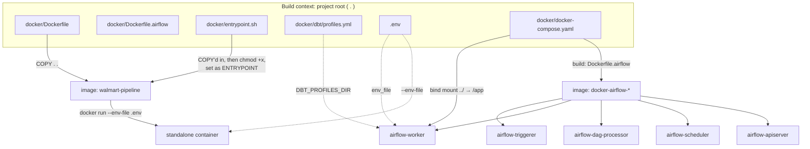
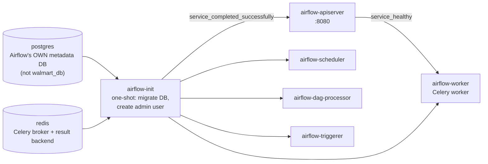
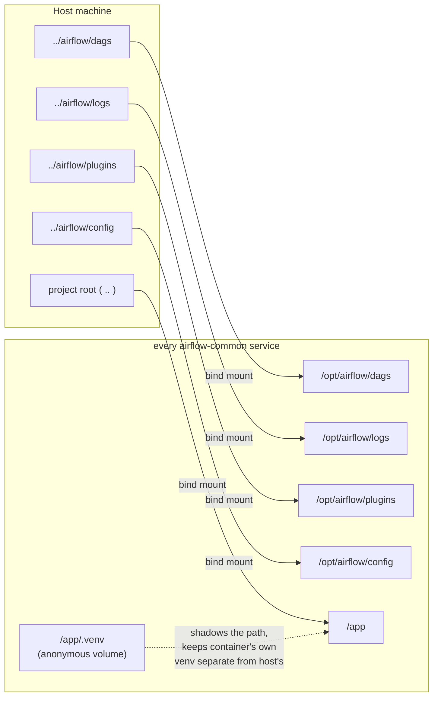
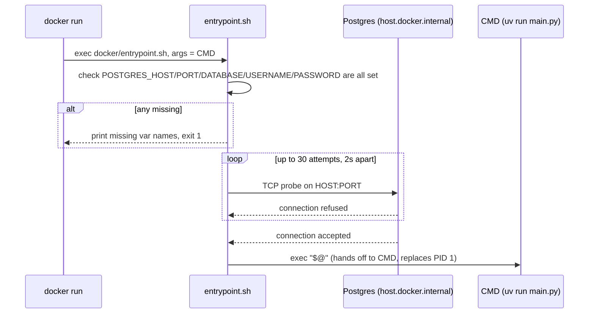

# Docker Setup — Walmart Medallion Pipeline

This document explains every file under `docker/`, what it builds, how the
files reference each other, and — because this stack genuinely fought us
on the way up — every real failure we hit getting it running, with the
actual root cause and fix for each.

---

## 1. Two images, two purposes

There are **two separate Dockerfiles** in this project, and they are not
alternatives to each other — they build two different images for two
different jobs:

| | `docker/Dockerfile` | `docker/Dockerfile.airflow` |
|---|---|---|
| **Builds** | `walmart-pipeline` — a self-contained image | The image every Airflow service in the compose stack runs |
| **Base image** | `python:3.12-slim` | `apache/airflow:3.3.0-python3.11` |
| **Gets the project code via** | `COPY . .` (baked into the image) | Bind mount (`../..:/app` at container start — no rebuild needed for code changes) |
| **Run with** | `docker build` + `docker run` directly | `docker compose up` |
| **Has its own entrypoint?** | Yes — `docker/entrypoint.sh` | No — keeps the official Airflow entrypoint |
| **Depends on Airflow?** | No — fully independent | N/A, it *is* the Airflow image |

Both images share the same JDK version, the same `uv` install, and the
same `PYTHON*`/`PYSPARK*`/`SPARK*` environment variables, so a pipeline
stage behaves identically whether it's triggered by `run_pipeline.ps1`
locally, `docker run walmart-pipeline`, or an Airflow task — the only
things that change between them are *how the code gets into the
container* and *what env vars have to be corrected for a containerized
network* (more on that in §9).

---

## 2. File inventory

```
docker/
├─ Dockerfile           → builds walmart-pipeline (standalone image)
├─ Dockerfile.airflow   → builds every service in docker-compose.yaml
├─ docker-compose.yaml  → orchestrates the full Airflow CeleryExecutor stack
├─ entrypoint.sh        → startup guard for the standalone image only
├─ dbt/
│  └─ profiles.yml      → project-scoped dbt credentials (see §8)
└─ .env.example         → template; copied to docker/.env for FERNET_KEY etc.
```

Plus, one level up:

```
airflow/
├─ dags/walmart_pipeline_dag.py   ← see airflow.md
├─ logs/, plugins/, config/       ← bind-mounted into every Airflow container
.env                              ← project-root env file, shared with run_pipeline.ps1
```

---

## 3. How the pieces connect



The standalone image (left) is self-contained — build once, run anywhere,
no compose file involved. The Airflow stack (right) is the opposite: the
image itself is nearly empty of project code on purpose, and everything it
needs is bind-mounted in at container start by `docker-compose.yaml`.

---

## 4. `docker/Dockerfile` — the standalone pipeline image

```dockerfile
FROM python:3.12-slim

RUN apt-get update && apt-get install -y --no-install-recommends \
    openjdk-17-jdk-headless \
    curl \
    && apt-get clean \
    && rm -rf /var/lib/apt/lists/*

ENV JAVA_HOME=/usr/lib/jvm/java-17-openjdk-amd64
ENV PATH="$JAVA_HOME/bin:$PATH"

RUN pip install --no-cache-dir uv

ENV PYTHONDONTWRITEBYTECODE=1
ENV PYTHONUNBUFFERED=1
ENV PYTHONPATH=/app
ENV SPARK_EXTRA_CLASSPATH=/app/jars/*
ENV PYSPARK_PYTHON=/app/.venv/bin/python
ENV PYSPARK_DRIVER_PYTHON=/app/.venv/bin/python

WORKDIR /app
COPY . .
RUN uv sync --frozen

RUN chmod +x docker/entrypoint.sh

ENTRYPOINT ["docker/entrypoint.sh"]
CMD ["uv", "run", "main.py"]
```

**Line-by-line, why each block exists:**

| Block | Why |
|---|---|
| `openjdk-17-jdk-headless` | PySpark needs a JVM under the hood; `-headless` skips the GUI libraries the container will never use |
| `JAVA_HOME` / `PATH` | Spark and PySpark both look for `JAVA_HOME` explicitly at startup |
| `pip install uv` | The project uses `uv` (not plain `pip`) for dependency resolution — installed via `pip` once, then used for everything after |
| `PYTHONPATH=/app` | Lets `scripts/`, `utils/`, etc. be imported as top-level packages regardless of which subfolder a command runs from |
| `SPARK_EXTRA_CLASSPATH=/app/jars/*` | Points Spark at the Mongo connector + Postgres JDBC jars checked into `jars/` |
| `PYSPARK_PYTHON` / `PYSPARK_DRIVER_PYTHON` | Forces Spark's driver and executors to use the project's `uv`-managed venv, not whatever `python3` resolves to on `PATH` |
| `COPY . .` *then* `uv sync --frozen` | Code copied in first, then `uv sync --frozen` builds `/app/.venv` from the exact versions pinned in `uv.lock` — reproducible, no surprise upgrades |
| `RUN chmod +x docker/entrypoint.sh` | **Necessary because of how `COPY` works.** A file coming from `COPY . .` keeps whatever permission bits it had on your host filesystem — and a plain file created on Windows/most editors isn't marked executable. Without this line, `ENTRYPOINT ["docker/entrypoint.sh"]` fails immediately with a permission error. |
| `ENTRYPOINT` / `CMD` split | Splitting these (instead of one combined `CMD ["docker/entrypoint.sh"]`) means `entrypoint.sh` *always* runs first no matter what, while `CMD` stays swappable — e.g. `docker run walmart-pipeline bash` replaces just the `CMD` half, and `entrypoint.sh`'s own `exec "$@"` at the end hands off to whatever was passed, so `bash`, `pytest`, etc. all still work. |

**Build & run:**
```bash
docker build -f docker/Dockerfile -t walmart-pipeline .
docker run --rm --env-file .env walmart-pipeline
```
Note the build context is `.` (project root), not `docker/` — that's what
makes `COPY . .` pull in `scripts/`, `walmart_dbt/`, `jars/`, etc.

---

## 5. `docker/Dockerfile.airflow` — the Airflow stack image

```dockerfile
FROM apache/airflow:3.3.0-python3.11

USER root

RUN apt-get update && apt-get install -y --no-install-recommends \
    openjdk-17-jdk-headless \
    curl \
    && apt-get clean \
    && rm -rf /var/lib/apt/lists/*

ENV JAVA_HOME=/usr/lib/jvm/java-17-openjdk-amd64
ENV PATH="$JAVA_HOME/bin:$PATH"

RUN mkdir -p /app/.venv && chown -R 50000:0 /app/.venv

USER airflow

RUN pip install --no-cache-dir uv

ENV PYTHONDONTWRITEBYTECODE=1
ENV PYTHONUNBUFFERED=1
ENV PYTHONPATH=/app
ENV SPARK_EXTRA_CLASSPATH=/app/jars/*
ENV PYSPARK_PYTHON=/app/.venv/bin/python
ENV PYSPARK_DRIVER_PYTHON=/app/.venv/bin/python
```

What's different from the standalone Dockerfile, and why:

- **Base image is Airflow itself**, not a bare Python image — this image
  needs to *be* a valid Airflow worker/scheduler/etc., so it inherits
  Airflow's own entrypoint, healthcheck tooling, and default user setup
  rather than reinventing them.
- **`USER root` → install JDK → `USER airflow`.** The base image already
  drops to a non-root `airflow` user by default; installing system
  packages requires switching back to `root` temporarily, then returning
  to the unprivileged user before anything else runs — containers
  shouldn't run as root any longer than strictly necessary.
- **No `COPY`, no `CMD`.** This image is intentionally close to empty of
  project code — `docker-compose.yaml` bind-mounts the whole repo into
  `/app` at container start (see §6), so editing a script or a dbt model
  never requires a rebuild. `CMD` isn't set either, since
  `docker-compose.yaml` passes each service's actual command
  (`api-server`, `scheduler`, `celery worker`, ...) explicitly.
- **The `chown` line — this one cost real debugging time**, covered in
  full in §10, but the short version: `docker-compose.yaml` mounts
  `/app/.venv` as an *anonymous volume* so the container's own venv never
  collides with a Windows `.venv` sitting in the same project folder on
  the host. Docker initializes a brand-new anonymous volume by copying
  whatever's already at that path *in the image* — ownership included. Pre-creating `/app/.venv` here and `chown`-ing it to the `airflow` user's UID (`50000:0`) means that when the volume is first populated, it's already writable by the non-root user every task actually runs as. Skip this step and `uv sync` fails with `Permission denied` the first time any task tries to create the venv.

---

## 6. `docker/docker-compose.yaml` — orchestrating the stack

Adapted from Apache Airflow's own 3.3.0 CeleryExecutor quick-start, with
five deliberate changes (each flagged `# CHANGED` in the file itself):

1. **Builds `Dockerfile.airflow`** instead of pulling `apache/airflow:3.3.0` directly — needs the JDK + `uv` baked in.
2. **Airflow's own runtime folders live in `../airflow`**, a sibling of `docker/`, not alongside the compose file.
3. **Every service bind-mounts the whole project root to `/app`**, plus an anonymous volume shadowing `/app/.venv` specifically (see §5 and §10).
4. **`airflow-worker` gets `extra_hosts: host.docker.internal`** so it can reach Postgres/Mongo running on the host machine.
5. **`AIRFLOW__CORE__LOAD_EXAMPLES=false`** — no tutorial DAGs cluttering the UI.

### Service topology



> ⚠️ **Important distinction:** the `postgres` service in this compose
> file is Airflow's *own* internal metadata database (DAG state, task
> instances, connections — user `airflow`, db `airflow`). It has nothing
> to do with `walmart_db`, the project's actual data warehouse, which
> runs on your host machine and is reached from inside containers via
> `host.docker.internal`. Two completely different Postgres instances,
> easy to conflate because both are just called "postgres."

### Volumes — what's mounted where



The anonymous `/app/.venv` volume is the subtle piece: without it, the
bind-mounted `/app` (which includes whatever `.venv` folder already
exists on your Windows host from local `uv run` usage) would leak a
Windows-built venv straight into the Linux container, which would then
try to execute Windows binaries and fail immediately. The anonymous
volume sits *on top of* that one path, hiding the host's `.venv` from the
container without affecting anything else in `/app`.

### Before first run
```bash
cd docker
mkdir -p ../airflow/dags ../airflow/logs ../airflow/plugins ../airflow/config
cp .env.example .env        # fill in FERNET_KEY
docker compose up airflow-init
docker compose up -d
```

---

## 7. `docker/entrypoint.sh` — startup guard for the standalone image

```bash
#!/usr/bin/env bash
set -euo pipefail

REQUIRED_VARS=(POSTGRES_HOST POSTGRES_PORT POSTGRES_DATABASE POSTGRES_USERNAME POSTGRES_PASSWORD)
missing=()
for var in "${REQUIRED_VARS[@]}"; do
  if [ -z "${!var:-}" ]; then
    missing+=("$var")
  fi
done
if [ "${#missing[@]}" -gt 0 ]; then
  echo "ERROR: missing required environment variable(s): ${missing[*]}" >&2
  exit 1
fi

echo "Waiting for Postgres at ${POSTGRES_HOST}:${POSTGRES_PORT}..."
attempt=0
max_attempts=30
until (exec 3<>"/dev/tcp/${POSTGRES_HOST}/${POSTGRES_PORT}") 2>/dev/null; do
  attempt=$((attempt + 1))
  if [ "$attempt" -ge "$max_attempts" ]; then
    echo "ERROR: Postgres not reachable after ${max_attempts} attempts (60s)." >&2
    exit 1
  fi
  sleep 2
done
echo "Postgres is reachable."

exec "$@"
```

This only runs for the standalone image — `Dockerfile.airflow` keeps
Airflow's own entrypoint, since Airflow already has its own startup
sequencing (migrations, health checks, etc.) that this script has no
business interfering with.



Three deliberate design choices here:
1. **Fails fast on missing env vars**, with the variable names printed —
   instead of a Python stack trace three layers deep once `main.py`
   actually tries to connect.
2. **Waits for Postgres to accept connections**, not just for the
   container to start — container start order alone doesn't guarantee the
   DB inside is ready to accept connections yet.
3. **`exec "$@"` at the end**, so `docker run walmart-pipeline bash` or
   `... pytest` still work — the script hands off control rather than
   wrapping the real command in a subshell.

It only checks the Postgres vars, deliberately — Mongo isn't in that list,
so a Mongo connection failure surfaces directly from `extract.py` instead.

---

## 8. `docker/dbt/profiles.yml` — project-scoped dbt credentials

dbt looks for `profiles.yml` in `~/.dbt/` by default. That directory:
- **doesn't exist inside these containers at all**, since credentials
  files are intentionally kept outside the repo and were never
  bind-mounted in, and
- even if it were mounted, the real `~/.dbt/profiles.yml` on this machine
  is a **global file shared across several unrelated dbt projects**
  (Databricks tokens for other work included) — not something that should
  be exposed inside this project's containers or committed to this repo.

The fix is a second, project-scoped `profiles.yml` containing only the
one relevant entry:

```yaml
walmart_dbt:
  outputs:
    dev:
      dbname: walmart_db
      host: "{{ env_var('POSTGRES_HOST', 'localhost') }}"
      pass: admin
      port: 5432
      schema: bronze
      threads: 4
      type: postgres
      user: postgres
  target: dev
```

The `host` field uses the same `env_var(...)` Jinja pattern already used
elsewhere in the global profiles file — it defaults to `localhost` (so
local, non-container dbt runs still work unmodified) but resolves to
whatever `POSTGRES_HOST` is exported as in the current shell. Since the
DAG's `_PREAMBLE` exports `POSTGRES_HOST=host.docker.internal` before any
dbt command runs (see `airflow.md` §5), this file needs zero
container-specific edits to work correctly in both places.

Because `docker/` lives inside the project root, this file is
automatically bind-mounted to `/app/docker/dbt/profiles.yml` — no
`docker-compose.yaml` changes needed. The DAG just points
`DBT_PROFILES_DIR` at `/app/docker/dbt`.

---

## 9. Environment variables — two worlds

The project-root `.env` is shared between local Windows execution
(`run_pipeline.ps1`) and everything running inside a Linux container. A
handful of values are correct for one world and wrong for the other:

| Variable | `.env` value (Windows-correct) | Needed inside containers | How it's resolved |
|---|---|---|---|
| `POSTGRES_HOST` | `localhost` | `host.docker.internal` | Airflow: overridden in DAG `_PREAMBLE`. Standalone image: set directly in `docker run --env-file` or `docker/.env` |
| `MONGO_URI` | `mongodb://localhost:27017` | `mongodb://host.docker.internal:27017` | Same — overridden in DAG `_PREAMBLE` via string substitution, `.env` itself untouched |
| `PYSPARK_PYTHON` / `PYSPARK_DRIVER_PYTHON` | `.venv\Scripts\python.exe` (Windows path) | `/app/.venv/bin/python` (Linux path) | `Dockerfile`/`Dockerfile.airflow` set these as image `ENV` — but since every task `source`s `.env`, the DAG's `_PREAMBLE` re-exports them afterward to force the Linux path to win |

`localhost` inside a container refers to *the container itself*, not the
host machine — this is a Docker networking fundamental, not a project
quirk, and it's the root cause of two of the three issues above.
`host.docker.internal` is Docker's special DNS name that resolves back to
the host machine from inside a container.

We deliberately chose **not** to edit `.env` itself for any of this — it's
referenced by several other files (`run_pipeline.ps1` included), so
correcting the container-specific values happens downstream, in the DAG
preamble, instead of upstream in the shared file. Full mechanics of that
override chain are in `airflow.md` §5.

---

## 10. Troubleshooting log — real issues, actual fixes

Every one of these was hit and fixed getting this exact stack running,
in the order encountered:

| # | Symptom | Root cause | Fix |
|---|---|---|---|
| 1 | `preflight` task: `/app/.env: line 12: $'\r': command not found`, exit 127 | Project-root `.env` had **Windows CRLF line endings**; `source`-ing it inside a Linux container chokes on the trailing `\r` | Stripped CRLFs from `.env` in-place on the host (bind mount means the container sees the fix immediately, no rebuild) |
| 2 | `preflight` task (after fix #1): `error: failed to open file /app/.venv/CACHEDIR.TAG: Permission denied (os error 13)` | The anonymous `/app/.venv` volume is created **owned by root** by Docker by default; tasks run as the non-root `airflow` user (`50000:0`) and can't write into it | Pre-created `/app/.venv` in `Dockerfile.airflow` and `chown -R 50000:0` before switching to `USER airflow`, so the volume inherits correct ownership on first mount |
| 3 | `extract` task: `AutoReconnect('localhost:27017: [Errno 111] Connection refused')` | `MONGO_URI` in `.env` pointed at `localhost`, which inside the container means the container itself, not the host running Mongo | Overrode `MONGO_URI`'s host in the DAG `_PREAMBLE` (`localhost` → `host.docker.internal`) rather than editing the shared `.env` |
| 4 | (caught proactively, before it broke a run) `PYSPARK_PYTHON`/`PYSPARK_DRIVER_PYTHON` in `.env` are Windows paths | `.env` is sourced by every task *after* the image's own `ENV` vars are set, so the Windows path would silently clobber the correct Linux one the moment `extract.py` started a Spark session | Forced both vars back to `/app/.venv/bin/python` in the DAG `_PREAMBLE`, after the `.env` source line |
| 5 | `dbt_silver_run` task: `Invalid value for '--profiles-dir': Path '/home/airflow/.dbt' does not exist` | dbt's default `~/.dbt/profiles.yml` isn't part of the repo and was never mounted into the container; even the real one on the host hardcodes `host: localhost` for this project | Created a project-scoped `docker/dbt/profiles.yml` with only the `walmart_dbt` entry (env_var-driven host), and pointed `DBT_PROFILES_DIR` at it from the DAG `_PREAMBLE` |

The common thread: **everything traces back to the same handful of causes**
— Windows-vs-Linux line endings and paths, `localhost` meaning different
things inside vs. outside a container, and Docker volume ownership
defaults — not anything wrong with the pipeline logic itself.

---

## 11. Quick reference

```bash
# Airflow stack — from docker/
mkdir -p ../airflow/dags ../airflow/logs ../airflow/plugins ../airflow/config
cp .env.example .env
docker compose up airflow-init
docker compose up -d --build --force-recreate   # after any Dockerfile.airflow edit

# Standalone image — from project root
docker build -f docker/Dockerfile -t walmart-pipeline .
docker run --rm --env-file .env walmart-pipeline

# UI
# http://localhost:8080  (airflow / airflow)
```