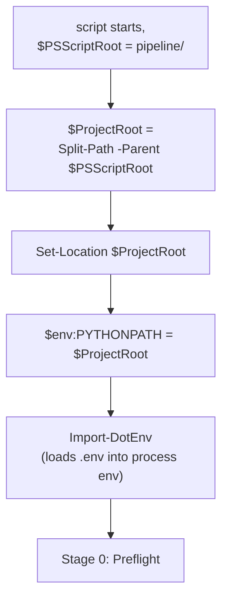
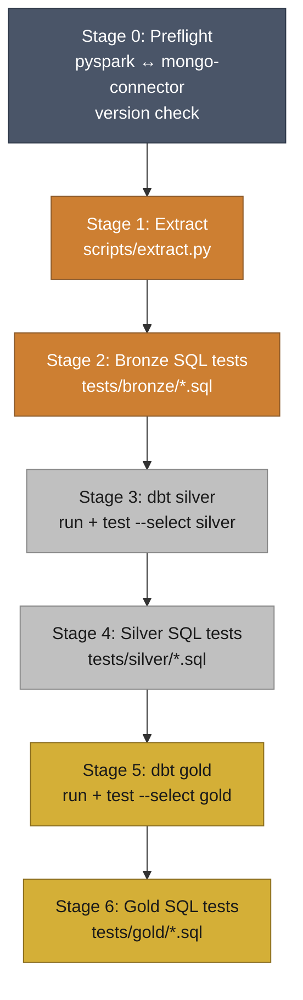
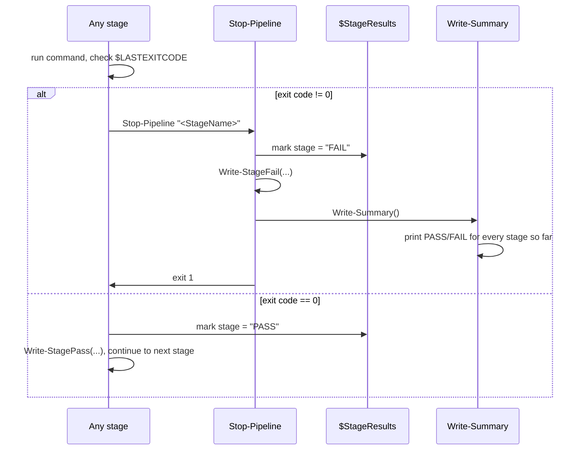

# `pipeline/run_pipeline.ps1` — Local Windows Entry Point

The manual, no-Docker way to run the full medallion pipeline: seven
stages, stop on first failure, clean terminal output with full detail
still captured in `logs/` via `utils/logger.py`. This is the script
`airflow/dags/walmart_pipeline_dag.py` was deliberately built to mirror
stage-for-stage — see §6 for the direct comparison.

> **Location note:** the script's own header comment says it lives in a
> `ps1/` folder; the actual project layout has it under `pipeline/`
> (`walmart/pipeline/run_pipeline.ps1`). Doesn't affect anything
> functionally — `$ProjectRoot = Split-Path -Parent $PSScriptRoot` just
> walks up one level from wherever the script actually sits — but the
> comment itself is stale.

---

## 1. Startup: finding the project root and setting `PYTHONPATH`



Two things happen before any pipeline stage runs:

1. **`$env:PYTHONPATH = $ProjectRoot`** — `scripts/*.py` are invoked as
   `python scripts/extract.py`, not `python -m scripts.extract`, so
   Python only puts `scripts/` itself on `sys.path` by default.
   Without this line, `from utils.connection import get_postgres_engine`
   (used throughout `scripts/`) would fail to import. This is the exact
   same problem `ENV PYTHONPATH=/app` solves in both Dockerfiles — see
   `docker.md` §4–5.
2. **`Import-DotEnv`** loads `.env` into the *process* environment so
   every child `uv run python ...` / `uv run dbt ...` call inherits it —
   PowerShell doesn't source `.env` files natively the way `bash`'s
   `source` does.

---

## 2. `Import-DotEnv` — the Windows equivalent of `source .env`

```powershell
function Import-DotEnv {
    param([string]$Path = ".env")
    if (-not (Test-Path $Path)) {
        Write-Host "WARNING: $Path not found at project root." -ForegroundColor Yellow
        return
    }
    Get-Content $Path | ForEach-Object {
        $line = $_.Trim()
        if ($line -and -not $line.StartsWith("#") -and $line.Contains("=")) {
            $key, $value = $line -split "=", 2
            [System.Environment]::SetEnvironmentVariable($key.Trim(), $value.Trim())
        }
    }
}
```

Line by line: reads `.env` one line at a time, skips blank lines and
`#`-comments, splits each remaining line on the *first* `=` only
(`-split "=", 2`, so a value containing `=` — a connection string, say —
doesn't get truncated), trims whitespace off both key and value, and sets
each as a process environment variable directly via .NET's
`SetEnvironmentVariable`, rather than PowerShell's own `$env:` syntax.

**Missing `.env` is a warning, not a hard failure** — the script keeps
going, on the assumption that the required variables might already be
set some other way (system environment variables, a parent shell,
etc.). This is intentional and is the exact behavior
`airflow/dags/walmart_pipeline_dag.py`'s own `_PREAMBLE` was written to
match: `if [ -f ".env" ]; then source ...; fi` — silent no-op if absent,
not a crash.

This is a simpler parser than `python-dotenv` (used by `utils/engine.py`
on the Python side) — no quoted-value handling, no multi-line values,
no `export` keyword support. Fine here because it only needs to satisfy
this one project's own `.env` format, not be a general-purpose parser.

---

## 3. The seven stages



| Stage | What runs | Working directory |
|---|---|---|
| 0. Preflight | `uv run python -c "import pyspark; print(pyspark.__version__)"`; if missing or not `3.5.x`, `uv add pyspark==3.5.5` | project root |
| 1. Extract | `uv run python scripts/extract.py` | project root |
| 2. Bronze SQL tests | `uv run python scripts/sql_test.py tests/bronze` | project root |
| 3. Silver dbt | `uv run dbt run --select silver` then (if that succeeded) `uv run dbt test --select silver` | `walmart_dbt/` — script `Set-Location`s in, then back out |
| 4. Silver SQL tests | `uv run python scripts/sql_test.py tests/silver` | project root |
| 5. Gold dbt | `uv run dbt run --select gold` then `uv run dbt test --select gold` | `walmart_dbt/` |
| 6. Gold SQL tests | `uv run python scripts/sql_test.py tests/gold` | project root |

The two dbt stages are the only ones that change directory — `dbt`
expects to run from inside a directory containing `dbt_project.yml`, so
the script `Set-Location`s into `walmart_dbt/`, runs both `dbt run` and
`dbt test`, then explicitly returns to `$ProjectRoot` before the next
stage, so every other stage can assume it's starting from project root.

**The gate between `dbt run` and `dbt test` within a stage:**
```powershell
uv run dbt run --select silver
$dbtRunExit = $LASTEXITCODE

if ($dbtRunExit -eq 0) {
    uv run dbt test --select silver
    $dbtTestExit = $LASTEXITCODE
} else {
    $dbtTestExit = 1
}
```
`dbt test` only runs at all if `dbt run` succeeded — no point validating
data that failed to build. If `dbt run` fails, `$dbtTestExit` is forced
to `1` without ever invoking `dbt test`, so the combined
`if ($dbtRunExit -ne 0 -or $dbtTestExit -ne 0)` check below still
correctly fails the whole stage.

---

## 4. Stop-on-first-failure



Every stage follows the same shape: run the command, check
`$LASTEXITCODE`, and on nonzero, call `Stop-Pipeline` with that stage's
name. `Stop-Pipeline` records the failure, prints it in red, prints the
full summary table of every stage's result up to that point (so you can
see at a glance which earlier stages passed before things broke), and
exits with code `1`.

`$StageResults` is an **ordered** hashtable (`[ordered]@{}`) specifically
so `Write-Summary` prints stages in the order they actually ran, not
alphabetically or in hash-bucket order.

This is functionally identical to how the Airflow DAG achieves the same
guarantee — see §6 below and `airflow.md` §4 — just implemented
explicitly here with manual exit-code checks, versus Airflow's built-in
`all_success` trigger rule doing it implicitly.

---

## 5. Terminal output design

Three small `Write-Stage*` helper functions keep the console output
consistent and skimmable:

| Function | Output |
|---|---|
| `Write-StageHeader` | A dark-gray divider, then the stage title in cyan (`" STEP 3 / 6  -  DBT SILVER (walmart_dbt)"`) |
| `Write-StagePass` | `" [PASS] <message>"` in green |
| `Write-StageFail` | `" [FAIL] <message>"` in red |
| `Write-Summary` | Divider, `"PIPELINE SUMMARY"` header, then every recorded stage name padded to 20 chars with its PASS/FAIL/(unset) status color-coded |

Deliberately terse — per the script's own synopsis, *"Terminal stays
clean: only a short header + PASS/FAIL line per stage."* Anything more
detailed (query output, failing row counts, full tracebacks) goes
through `utils/logger.py` into the day's log file instead of the
terminal, exactly as documented in `utils.md` §4.

---

## 6. Side-by-side with the Airflow DAG

Both this script and `walmart_medallion_pipeline` (`airflow.md`) exist to
run the exact same seven-stage pipeline — one for local, interactive,
Windows-native runs; the other for scheduled/containerized runs. They're
kept in lockstep on purpose:

| | `run_pipeline.ps1` | `walmart_medallion_pipeline` DAG |
|---|---|---|
| Stages | 7 (0–6) | 9 tasks (preflight splits are the same 7 logical stages — dbt run/test are separate Airflow tasks rather than one combined stage) |
| Stop-on-failure | Manual: every stage checks `$LASTEXITCODE`, calls `Stop-Pipeline` | Automatic: Airflow's default `all_success` trigger rule |
| Env loading | `Import-DotEnv` — custom line-by-line parser, `.env` at project root | `source .env` inside each task's shell, plus explicit overrides for container-only values (`airflow.md` §5) |
| `PYTHONPATH` | `$env:PYTHONPATH = $ProjectRoot` | `export PYTHONPATH=/app` (same idea, container path) |
| `POSTGRES_HOST` / `MONGO_URI` | Used as-is from `.env` — `localhost` is correct here, since this runs directly on the host machine | Rewritten to `host.docker.internal` in the DAG's `_PREAMBLE`, since `localhost` inside a container means something different |
| dbt profile source | Global `~/.dbt/profiles.yml` on the host (the real one, with all projects) | Project-scoped `docker/dbt/profiles.yml` via `DBT_PROFILES_DIR` (`docker.md` §8) |
| Output | Color-coded terminal + `logs/` | Airflow UI Grid view + task logs |

The practical implication: **if you ever change the stage order, add a
stage, or change what "success" means for one, update both files.**
Nothing enforces that they stay in sync automatically — it's a
convention the two files' own comments call out, not something Airflow
or PowerShell verifies for you.

---

## 7. Requirements (from the script's own `.NOTES`)

- `uv` installed and on `PATH`
- `sqlalchemy` + `psycopg2-binary` available in the project env (`uv add sqlalchemy psycopg2-binary`)
- `dbt-postgres` available in the project env
- A `.env` file at project root with `POSTGRES_HOST` / `POSTGRES_PORT` / `POSTGRES_DATABASE` / `POSTGRES_USERNAME` / `POSTGRES_PASSWORD`
- `utils/__init__.py` must exist at project root — required for `from utils.logger import get_logger` (and `from utils.connection import ...`) to resolve, per `utils.md` §1's note on relative imports

---

## 8. Quick reference

```powershell
# From anywhere — the script resolves its own project root
.\pipeline\run_pipeline.ps1
```

Exit code `0` on full success (falls through to `Write-Summary` after
Stage 6); exit code `1` the moment any stage fails, with the summary
table showing exactly which stages passed before the failure.