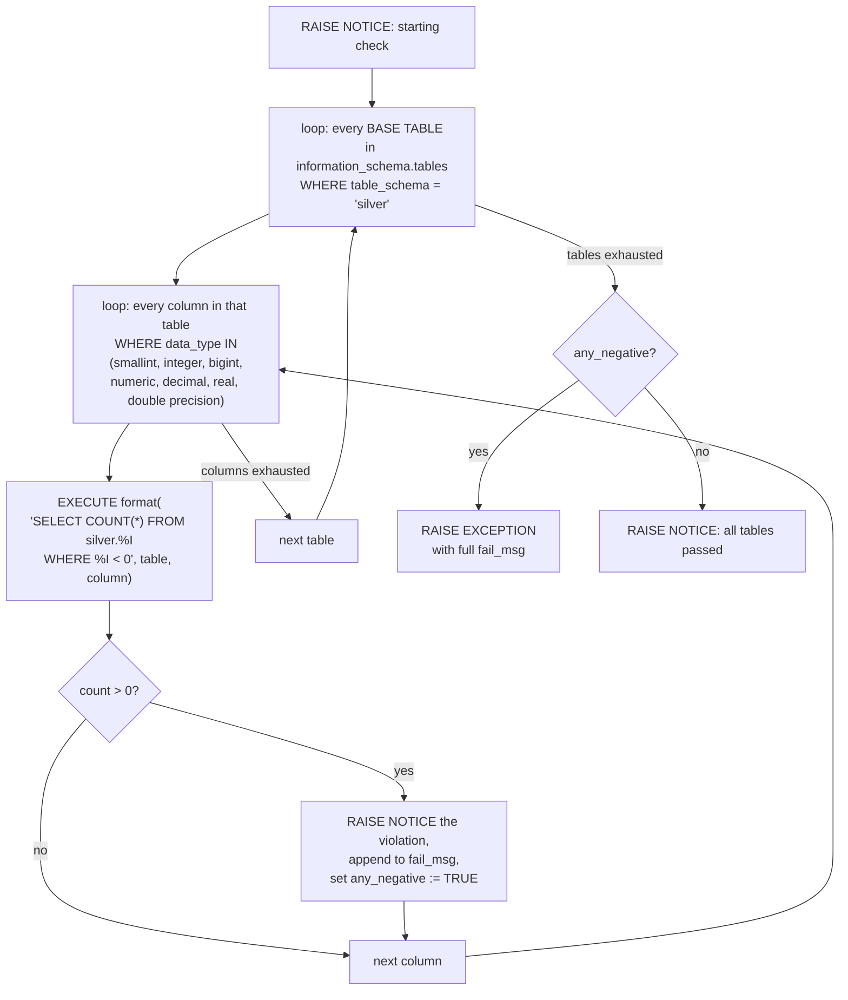
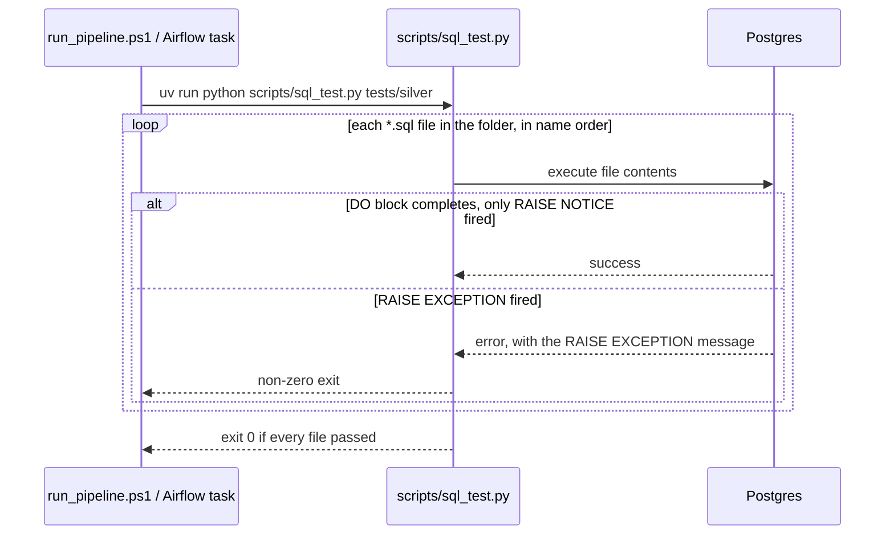

# `tests/` — Standalone SQL Data-Quality Suite

Raw PL/pgSQL scripts, one per check, grouped by medallion layer. **Not**
dbt tests — this is a separate system, run through `scripts/sql_test.py`
and invoked as its own pipeline stage in both `run_pipeline.ps1` and the
Airflow DAG. See `dbt.md` §8 for the full distinction between this folder
and `walmart_dbt/tests/generic/`.

```
tests/
├─ bronze/   (3 checks)
├─ silver/   (9 checks)
└─ gold/     (7 checks)
```

---

## 1. The design: one generic loop, not one script per table

The defining trait of this suite — confirmed from the one full example
available, `04_lp_check_negative_values.sql` — is that a check is written
**once per rule, against an entire schema**, not once per table. Instead
of hardcoding `SELECT COUNT(*) FROM silver.orders WHERE total_amount < 0`,
`SELECT COUNT(*) FROM silver.products WHERE price < 0`, and so on for
every numeric column in every table, the script discovers its targets
dynamically from Postgres's own `information_schema` and builds the
actual query at runtime.



**Why this matters:** adding a new table to the silver schema doesn't
require touching this script at all — the outer loop picks it up
automatically the next time the check runs, and only tests the column
types actually relevant to a "negative value" check (skipping text,
timestamp, boolean columns entirely via the `data_type IN (...)` filter).

### The full example, annotated

```sql
DO $$
DECLARE
    tbl RECORD;
    col RECORD;
    negative_count BIGINT;
    has_negative BOOLEAN;
    any_negative BOOLEAN := FALSE;
    fail_msg TEXT := '';
BEGIN
    FOR tbl IN
        SELECT table_name
        FROM information_schema.tables
        WHERE table_schema = 'silver' AND table_type = 'BASE TABLE'
        ORDER BY table_name
    LOOP
        has_negative := FALSE;

        FOR col IN
            SELECT column_name
            FROM information_schema.columns
            WHERE table_schema = 'silver'
              AND table_name = tbl.table_name
              AND data_type IN ('smallint','integer','bigint','numeric','decimal','real','double precision')
            ORDER BY ordinal_position
        LOOP
            EXECUTE format(
                'SELECT COUNT(*) FROM silver.%I WHERE %I < 0',
                tbl.table_name, col.column_name
            )
            INTO negative_count;

            IF negative_count > 0 THEN
                has_negative := TRUE;
                any_negative := TRUE;
                fail_msg := fail_msg || format(
                    '%s.%s (%s negative values); ',
                    tbl.table_name, col.column_name, negative_count
                );
            END IF;
        END LOOP;
    END LOOP;

    IF any_negative THEN
        RAISE EXCEPTION 'Negative value check FAILED: %', fail_msg;
    ELSE
        RAISE NOTICE 'All Silver tables passed negative value validation.';
    END IF;
END $$;
```

Three things worth calling out:

- **`format(..., %I, ...)`** — `%I` is Postgres's identifier-quoting
  format specifier, safely interpolating table/column names discovered
  at runtime into dynamic SQL without manual quoting or injection risk
  (this isn't user input, but it's still the correct tool for
  runtime-assembled identifiers).
- **Failures accumulate, they don't short-circuit.** Every offending
  table/column is collected into `fail_msg` before the single
  `RAISE EXCEPTION` at the very end — so one run tells you about *every*
  violation across the whole schema, not just the first one it happens to
  hit.
- **`RAISE EXCEPTION` is the pass/fail signal.** A clean run only ever
  emits `RAISE NOTICE` (informational, doesn't affect the SQL command's
  success). The moment `RAISE EXCEPTION` fires, the `DO` block itself
  fails as a Postgres command — which is what `scripts/sql_test.py`
  detects as this check having failed (see §3).

---

## 2. Full file inventory

Only `04_lp_check_negative_values.sql` (silver) was shared in full — the
walkthrough above is verified against its actual content. Every other
file's purpose below is inferred from its name and from the shared,
consistent design pattern (`lp_` prefix, one rule per file, applied
schema-wide via the same `information_schema` loop shape) — treat these
as *expected* behavior, not confirmed line-by-line.

### `tests/bronze/` — 3 checks

| File | Presumed check |
|---|---|
| `01_lp_check_bronze_tables.sql` | All expected bronze tables (`customers`, `orders`, `order_items`, `products`, `stores`, `employees` — matching `source.yml`) actually exist in the schema |
| `02_lp_check_columns_exist.sql.sql` | Every expected column is present on each bronze table (note the doubled `.sql.sql` extension — a filename typo, harmless: a `*.sql` glob still matches it since it ends in `.sql`) |
| `03_lp_check_metadata_columns.sql` | Load/metadata columns (e.g. an extraction timestamp) exist and are populated on every bronze table |

### `tests/silver/` — 9 checks

| File | Presumed check |
|---|---|
| `01_lp_check_duplicates.sql` | No duplicate primary-key values per table (mirrors the `unique` tests already declared in `schema.yml` — this is the same idea run as a raw SQL loop instead of a dbt test) |
| `02_lp_check_nulls.sql` | Required columns have no unexpected `NULL`s |
| `03_lp_check_numeric_format.sql` | Numeric columns actually contain valid numeric data (no stray text made it through type casting) |
| `04_lp_check_negative_values.sql` | ✅ Confirmed — see §1 |
| `05_lp_check_foreign_keys.sql` | FK columns resolve to a real row in the referenced table (raw-SQL equivalent of `relationships` tests in `schema.yml`) |
| `06_lp_check_date_ranges.sql` | Timestamp columns fall within a sane range (not in the future, not before some epoch) |
| `07_lp_check_domain_values.sql` | Categorical columns (e.g. `order_status`) only contain expected values |
| `09_lp_check_unwanted_spaces.sql` | Text columns free of leading/trailing/double whitespace |
| `10_lp_check_business_rules.sql` | Cross-column rules, e.g. `line_amount = round(quantity * unit_price, 2)` — the raw-SQL sibling of `dbt_utils.expression_is_true` in `schema.yml` |

> Numbering skips straight from `07` to `09` — an `08` was likely
> renumbered or removed at some point. Doesn't affect anything
> functionally (`scripts/sql_test.py` presumably just runs whatever `.sql`
> files exist in the folder), just a gap worth being aware of.

### `tests/gold/` — 7 checks

| File | Presumed check |
|---|---|
| `01_lp_check_not_empty.sql` | Every gold table has at least one row (catches a `dbt run` that "succeeded" but produced nothing) |
| `02_lp_check_date_ranges.sql` | Same idea as silver's date-range check, applied to gold |
| `03_lp_check_duplicates.sql` | No duplicate dimension/fact keys |
| `04_lp_check_negative.sql` | Gold-layer sibling of silver's `04_lp_check_negative_values.sql` |
| `05_lp_check_referential_integrity.sql` | Fact-to-dimension FK integrity (`fact_order_items` → `dim_orders`/`dim_products`, etc.) |
| `06_lp_check_unwanted_spaces.sql` | Gold-layer sibling of silver's `09_lp_check_unwanted_spaces.sql` |
| `07_row_count_validation.sql` | Row counts reconcile between layers — e.g. gold dimension row count matches its silver source, catching silent data loss across a `dbt run` |

---

## 3. How this suite actually runs



This is the same contract every other pipeline stage relies on —
`run_pipeline.ps1` checks `$LASTEXITCODE`, the Airflow DAG relies on the
bash task's own exit code — so a single `RAISE EXCEPTION` anywhere in one
file is what turns `bronze_sql_tests` / `silver_sql_tests` /
`gold_sql_tests` red in either runner, exactly as documented in
`pipeline.md` §3 and `airflow.md` §2.

`scripts/sql_test.py` itself wasn't shared, so its exact file-discovery
and connection logic isn't documented here — but its observed contract
(folder path in, per-file pass/fail out, non-zero process exit on any
failure) is consistent across every place it's invoked in this project.

---

## 4. Naming conventions observed

- Every file is prefixed `NN_lp_check_...` — a consistent two-digit order
  prefix plus a shared `lp_` tag (likely author/reviewer initials),
  followed by a `check_<what>` description.
- File count roughly tracks layer complexity: bronze (raw, least
  validated) has 3 checks, silver (heaviest transformation) has 9, gold
  (final, dimensional) has 7.
- Several checks are deliberately mirrored across layers with matching
  names (`check_duplicates`, `check_date_ranges`, `check_unwanted_spaces`,
  a `negative`/`negative_values` pair) — the same rule, re-applied at
  each stage the data passes through, rather than validated once and
  trusted downstream.

---

## 5. Quick reference

```bash
# From project root
uv run python scripts/sql_test.py tests/bronze
uv run python scripts/sql_test.py tests/silver
uv run python scripts/sql_test.py tests/gold
```

```sql
-- Run a single check directly against Postgres, outside the pipeline
\i tests/silver/04_lp_check_negative_values.sql
```
