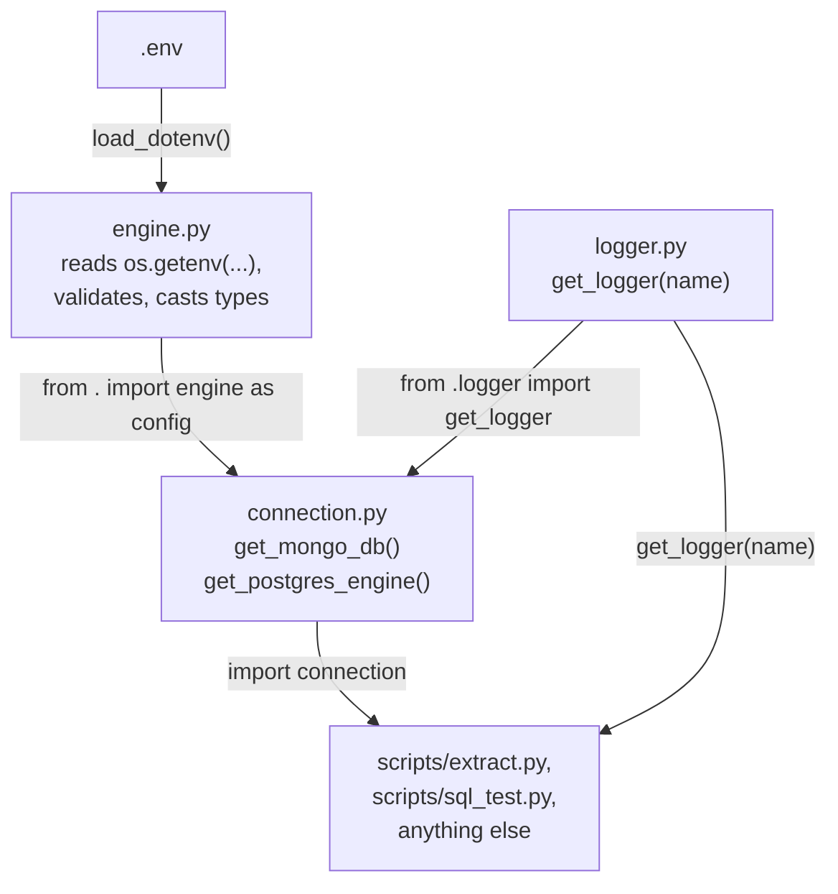
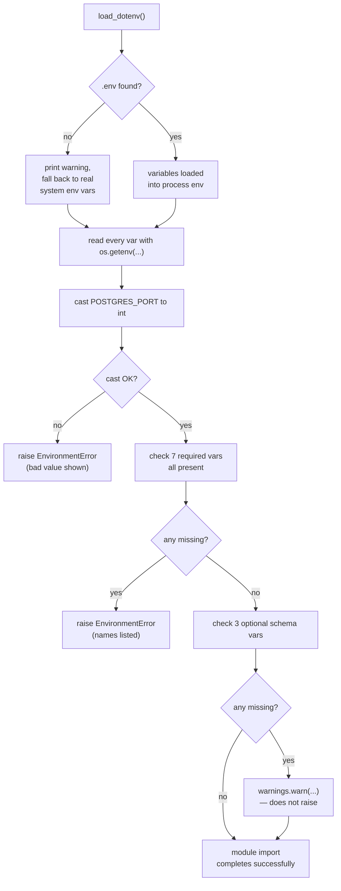
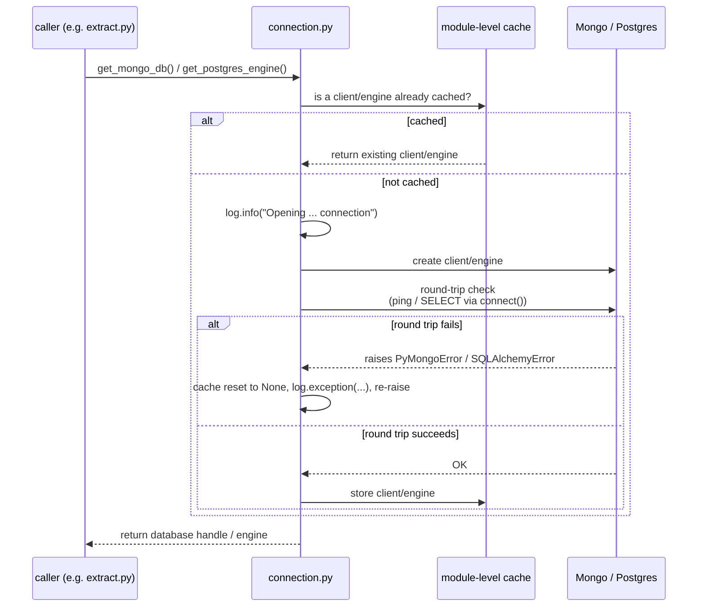
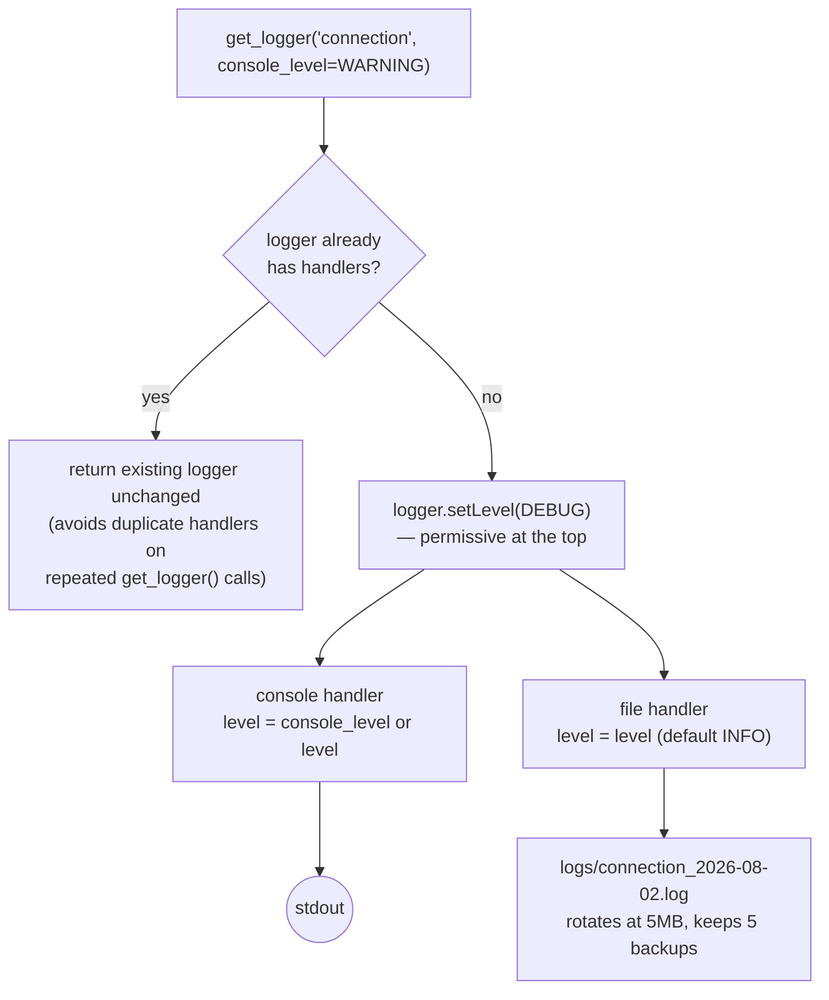
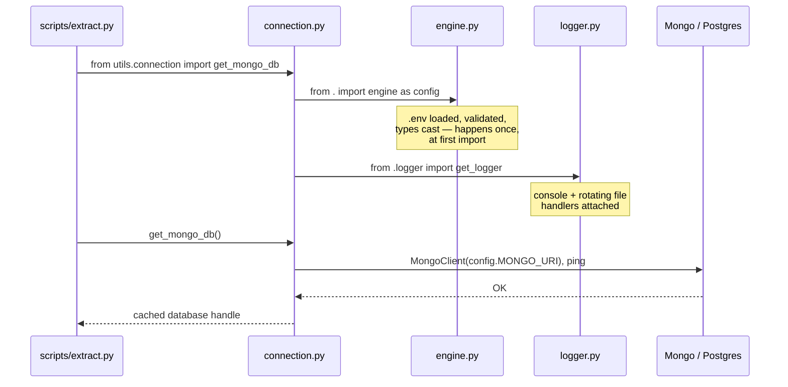

# `utils/` — Shared Infrastructure

Three small modules that every script in this project builds on: where
connections come from, where configuration comes from, and where logs go.
None of them touch business logic — they exist so `scripts/extract.py`,
`scripts/sql_test.py`, and anything else added later don't each
reimplement "read the env vars," "open a DB connection," and "set up
logging" from scratch.

```
utils/
├─ engine.py       ← reads & validates every env var, once, at import time
├─ connection.py   ← lazily opens/caches the actual Mongo + Postgres connections
└─ logger.py       ← shared console + rotating-file logging setup
```

---

## 1. How the three files depend on each other



`connection.py` is the only file that depends on the other two — it pulls
validated config from `engine.py` and a ready-to-use logger from
`logger.py`. `engine.py` and `logger.py` don't depend on each other or on
`connection.py` at all, so either can be imported standalone (`logger.py`
in particular is generic enough to use anywhere, not just for DB code).

Note the relative imports — `from . import engine as config` and
`from .logger import get_logger` — which means `connection.py` must be
imported as part of the `utils` package (`from utils.connection import
get_postgres_engine`, run with `utils/` on `PYTHONPATH` and containing an
`__init__.py`), not executed directly as a standalone script.

---

## 2. `engine.py` — configuration, validated once at import time



**What it reads:**

| Category | Variables | Required? |
|---|---|---|
| Postgres | `POSTGRES_HOST`, `POSTGRES_PORT`, `POSTGRES_DATABASE`, `POSTGRES_USERNAME`, `POSTGRES_PASSWORD` | Yes — raises `EnvironmentError` if any are missing |
| Mongo | `MONGO_URI`, `MONGO_DB` | Yes — same |
| Postgres medallion schemas | `POSTGRES_SCHEMA_BRONZE`, `POSTGRES_SCHEMA_SILVER`, `POSTGRES_SCHEMA_GOLD` | No — only needed by scripts that write a bronze/silver/gold layout; missing values just emit a `warnings.warn(...)` |
| PySpark | `PYSPARK_PYTHON`, `PYSPARK_DRIVER_PYTHON` | Read here so a missing value is caught early with a clear message, but not passed anywhere manually — Spark reads these straight from the process environment itself once `load_dotenv()` has run |

**Why validation happens at import time, not lazily:** every other module
in this project imports `engine.py` (directly, or indirectly through
`connection.py`) expecting its constants to already be correct. Doing the
validation as soon as the module loads means a misconfigured `.env`
fails immediately and loudly, with every missing variable name listed at
once — instead of surfacing as a confusing `NoneType` error deep inside a
Postgres driver call, potentially minutes into a pipeline run.

**`POSTGRES_PORT` is cast to `int` explicitly** — every value from
`os.getenv()` is a string by default, and passing a string port into a
driver that expects an integer can fail in ways that are harder to
diagnose than a clear `EnvironmentError` raised right here, with the bad
value shown.

This module ties directly into the Airflow/Docker environment chain
covered in `airflow.md` — when a task runs `uv run python
scripts/extract.py`, the DAG's `_PREAMBLE` has already exported
`POSTGRES_HOST=host.docker.internal` etc. into the shell *before* Python
starts, so `engine.py`'s `os.getenv("POSTGRES_HOST")` picks up the
corrected container value automatically, with no code here aware that
Docker or Airflow exist.

---

## 3. `connection.py` — lazy, cached connections



**Two public functions, same pattern for both:**

| | `get_mongo_db()` | `get_postgres_engine()` |
|---|---|---|
| Client type | `pymongo.MongoClient` | SQLAlchemy `Engine` |
| Cache variable | module-level `_mongo_client` | module-level `_postgres_engine` |
| Connectivity check | `admin.command("ping")` | `with engine.connect(): pass` |
| Returns | the database object (`client[MONGO_DB]`), not the raw client | the engine itself |
| On failure | cache reset to `None`, `log.exception(...)`, re-raises the original exception | same |

**Why the round-trip check on first use:** creating a `MongoClient` or a
SQLAlchemy `Engine` doesn't actually open a network connection by
itself — both are lazy by design. Forcing one real round trip
immediately (a `ping`, a bare `connect()`) means a bad host, bad
credentials, or an unreachable database surfaces right here, in a
function whose whole job is "connect to the database," rather than on
some unrelated line of code the first time a query happens to run.

**Why the module-level cache:** every script that calls
`get_postgres_engine()` more than once — or that imports `connection.py`
from multiple places — gets back the *same* engine/client instead of
opening a new connection each time. The `global` + `is None` check is a
simple singleton pattern; resetting to `None` on failure means the next
call retries a fresh connection rather than permanently caching a broken
one.

**Logging is intentionally quiet on the console.** `get_logger("connection",
console_level=logging.WARNING)` means routine "Opening MongoDB
connection..." / "Opening Postgres connection..." messages are written
at `INFO` level to the log file only — they don't clutter the terminal on
every run, but they're still there in `logs/connection_<date>.log` if you
need to confirm exactly when and to what a connection was opened.

---

## 4. `logger.py` — one logging setup, shared everywhere



**Console and file can show different detail levels independently.** The
logger itself is set to `DEBUG` — as permissive as possible — and each
*handler* applies its own filter on top of that. This is what makes
`get_logger("connection", console_level=logging.WARNING)` work: the file
handler still defaults to `INFO` and captures the routine "Opening
connection..." messages, while the console handler is turned down to
`WARNING`, so only genuine problems get printed where you're actually
watching.

**One log file per day, per logger name** — `logs/{name}_{YYYY-MM-DD}.log`,
e.g. `logs/connection_2026-08-02.log`, `logs/extract_2026-08-02.log`.
`RotatingFileHandler` then rotates *that* file further if it exceeds 5 MB
within the same day, keeping up to 5 backups (`.log.1` through `.log.5`)
— so a single unusually busy day still doesn't produce one unbounded
file.

**The `if logger.handlers: return logger` guard matters more than it
looks.** Since Python caches logger instances by name
(`logging.getLogger(name)` always returns the same object for the same
`name`), calling `get_logger("connection")` a second time — from a second
import of `connection.py`, or from unrelated code that also wants a
`"connection"` logger — would otherwise attach a second set of console +
file handlers, and every subsequent log line would be printed and
written twice (then three times, etc.). This check makes `get_logger()`
idempotent: safe to call repeatedly with the same name.

**`logger.propagate = False`** at the end stops messages from also
bubbling up to the Python root logger, which would otherwise risk a
*third* copy of every line if anything else in the process has its own
root-level handler configured.

**`LOG_DIR` is computed relative to `logger.py`'s own location** —
`utils/../logs` — rather than relative to the current working directory,
so logs always land in the same `logs/` folder at the project root
regardless of which subfolder a given script is actually run from (e.g.
`dbt_silver_run` tasks `cd` into `walmart_dbt/` before running, but any
Python code using this logger would still write to the top-level `logs/`
correctly).

---

## 5. Typical call flow, end to end



The first `import` anywhere in the process that pulls in `connection.py`
transitively triggers `engine.py`'s full validation pass — so if `.env`
is missing a required variable, the failure happens at the very top of a
script's execution (during imports), before any actual pipeline logic
runs.

---

## 6. Quick reference

```python
from utils.connection import get_mongo_db, get_postgres_engine
from utils.logger import get_logger

log = get_logger("my_script")               # INFO+ to both console and file
log = get_logger("my_script", console_level=logging.WARNING)  # quiet console, full file

db = get_mongo_db()             # cached pymongo Database
engine = get_postgres_engine()  # cached SQLAlchemy Engine
```

| File | Fails how, when |
|---|---|
| `engine.py` | Raises `EnvironmentError` at import time if a required var is missing or `POSTGRES_PORT` isn't a valid int. Warns (doesn't raise) if optional schema vars are missing. |
| `connection.py` | Raises the original `PyMongoError`/`SQLAlchemyError` the first time a connection is actually attempted, after logging the full exception. |
| `logger.py` | Doesn't raise — `os.makedirs(LOG_DIR, exist_ok=True)` creates `logs/` if it doesn't exist yet. |